# watsonx.data integration
## Hands-on Lab Guide
### Batch ETL/ELT flows with DataStage

---

## Table of Contents

1. [Introduction](#1-introduction)
   - [1.1 About this hands-on lab](#11-about-this-hands-on-lab)
2. [Accessing the Environment](#2-accessing-the-environment)
   - [2.1 Logging in as a client](#21-logging-in-as-a-client)
   - [2.3 Lab Pre-requisite – Download the lab project files](#23-lab-pre-requisite--download-the-lab-project-files)
3. [Set up your first project](#3-set-up-your-first-project)
   - [3.1 Create a project](#31-create-a-project)
   - [3.2 Walkthrough of the created project](#32-walkthrough-of-the-created-project)
4. [Run an existing batch flow](#4-run-an-existing-batch-flow)
   - [4.1 Check your progress](#41-check-your-progress)
5. [Edit the batch flow](#5-edit-the-batch-flow)
   - [5.1 Specify the key column for the Join stage](#51-specify-the-key-column-for-the-join-stage)
   - [5.2 Add credit score data from a PostgreSQL database](#52-add-credit-score-data-from-a-postgresql-database)
   - [5.3 Add a Join stage to join the credit score data with the applicant and application data](#53-add-a-join-stage-to-join-the-credit-score-data-with-the-applicant-and-application-data)
   - [5.4 Add a Transformer stage to calculate total debt](#54-add-a-transformer-stage-to-calculate-total-debt)
   - [5.5 Add interest rate data from a MongoDB database](#55-add-interest-rate-data-from-a-mongodb-database)
   - [5.6 Add a Lookup stage to look up interest rates for applicants](#56-add-a-lookup-stage-to-look-up-interest-rates-for-applicants)
   - [5.7 Edit the Sequential file node and run the DataStage flow](#57-edit-the-sequential-file-node-and-run-the-datastage-flow)
6. [Create reusable batch data pipelines with parameters](#6-create-reusable-batch-data-pipelines-with-parameters)
   - [6.1 Create a parameter set](#61-create-a-parameter-set)
   - [6.2 Use a parameter set inside a batch flow](#62-use-a-parameter-set-inside-a-batch-flow)
   - [6.3 Standardize frequently used parameter values with value sets](#63-standardize-frequently-used-parameter-values-with-value-sets)
7. [Conclusion and Next Steps](#7-conclusion-and-next-steps)
8. [Lab Reference Materials](#8-lab-reference-materials)
   - [8.1 Helpful Links](#81-helpful-links)

---

## 1 Introduction

In the rapidly evolving landscape of data management and analytics, enterprises are constantly seeking robust, scalable, and flexible data integration solutions to harness the power of their data in a cost-efficient, trusted manner.

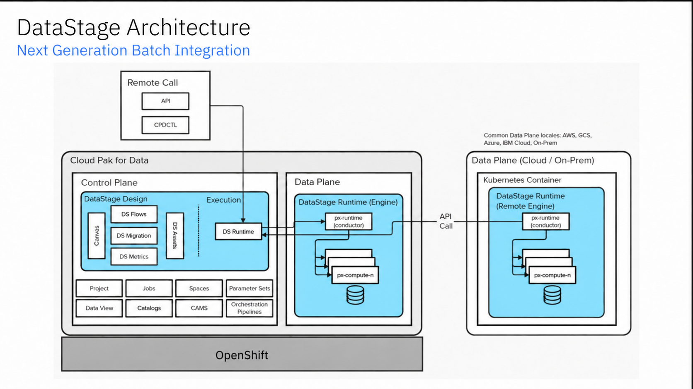

DataStage is a modernized data integration solution to collect and deliver trusted data anywhere, at any scale and complexity, on and across multi cloud and hybrid cloud environments. DataStage was re-architected from the Information Server stack to be a fully cloud-native and microservices-based offering:

- **Design once, run anywhere** paradigm allows you to bring data integration to where your data resides.
  - Fully managed control plane for authoring and orchestrating pipelines and managing assets.
  - Best in breed, containerized parallel engine processes substantial data volumes and built-in automatic workload balancing supports scalability and elasticity.
  - With a fully cloud-native architecture, DataStage can dynamically scale workloads and optimize for large data sets.
- You can import your existing parallel/sequence jobs into DataStage using the ISX upload utility.

---

### 1.1 About this hands-on lab

Using DataStage, the goal of this lab is to transform data stored in three external data sources and then deliver that transformed data to a single output file.

**Use Case Overview**

Golden Bank needs to adhere to a new regulation where it cannot lend to underqualified loan applicants. As a data engineer at Golden Bank, you currently use DataStage to aggregate your anonymized mortgage applications data with the mortgage applicants' personally identifiable information. Your lenders use this information to help them decide whether they should approve or deny mortgage applications. Your leadership added some risk analysts who calculate daily what interest rate they recommend offering to borrowers in each credit score range. You need to integrate this information into the spreadsheet you share with the lenders. The spreadsheet includes credit score information for each applicant, the applicant's total debt, and an interest-rate lookup table. Lastly, load your data into a target output CSV file.

---

## 2 Accessing the Environment

### 2.1 Logging in as a client

1. Log into the IBM watsonx Data Fabric page – https://dataplatform.cloud.ibm.com/wx/home?context=df
2. Ensure that you select the Toronto region, then allow the page to refresh.
3. Switch to logging in with an AppID, then provide your AppID alias *(Insert AppID alias here)*
4. Verify your page looks similar to below, then click **Log in**.

   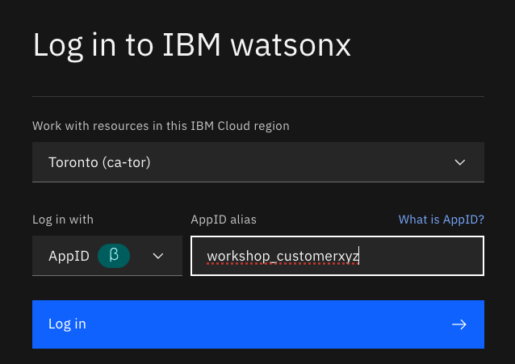

   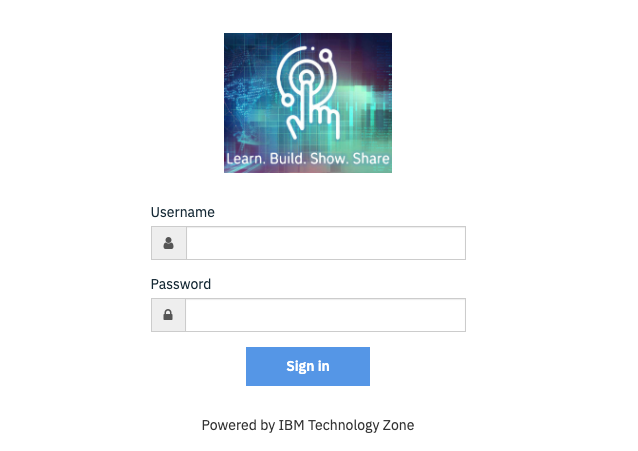

5. Log in using the App ID credentials provided by your IBM technical specialist:

   > Insert login credentials here:
   > Example - Customer First/Last Name: `customer0@techzone.ibm.com` `Dn#SVkXcns2Ba`

   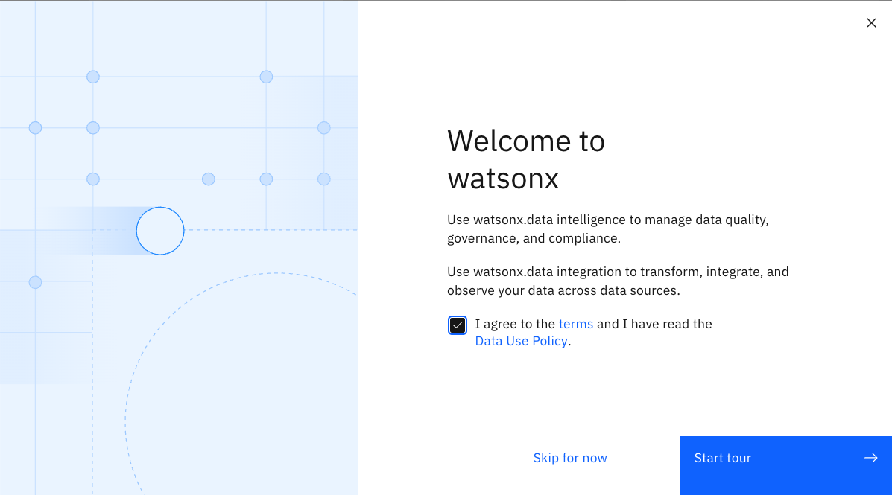

6. You should see this menu when you enter watsonx successfully. Click **Skip for now**.

   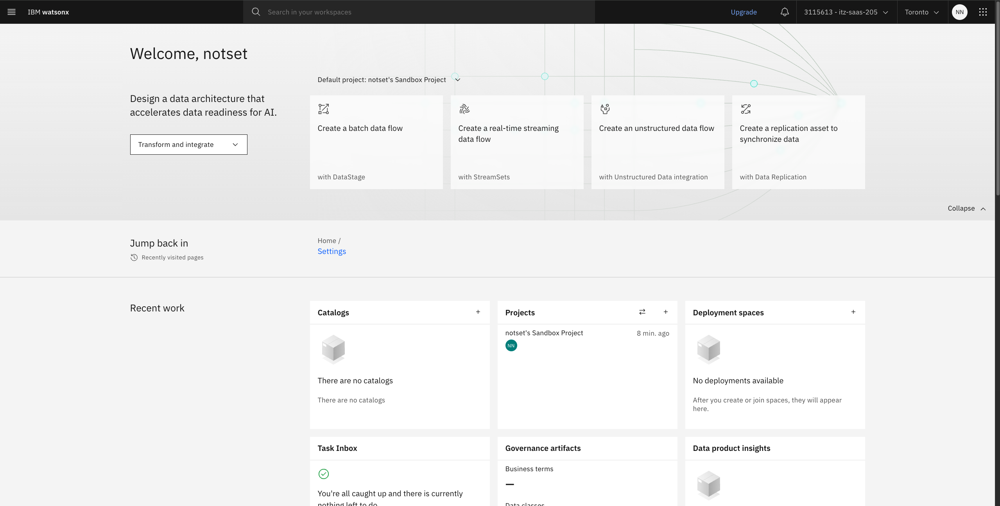

   > Welcome to watsonx.data integration!

---

### 2.3 Lab Pre-requisite – Download the lab project files

1. Download the project ZIP file for this lab using the link. Click **Download** on the top right.

   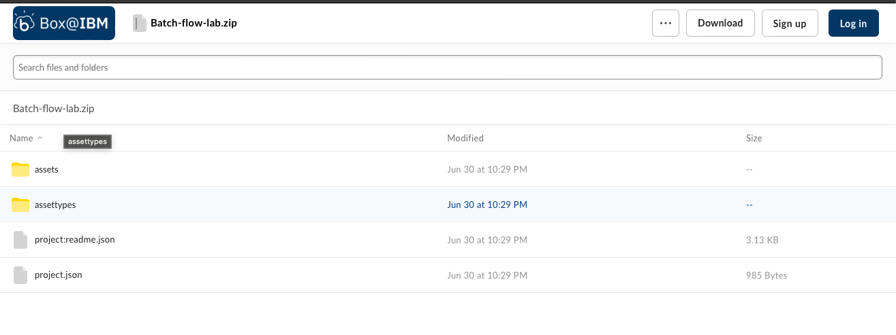

---

## 3 Set up your first project

A project is a collaborative workspace in watsonx.data integration where you work with data and other assets to accomplish a particular goal. In this case, we are using projects to transform and integrate data with DataStage to validate address data.

### 3.1 Create a project

1. Back in the home page, click the , then click **View All Projects** under Projects.

   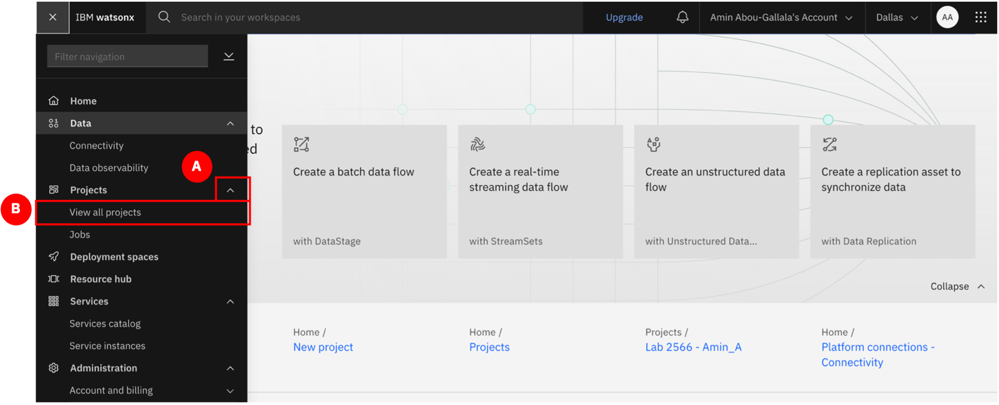

2. Click **New Project** in the top right corner.

   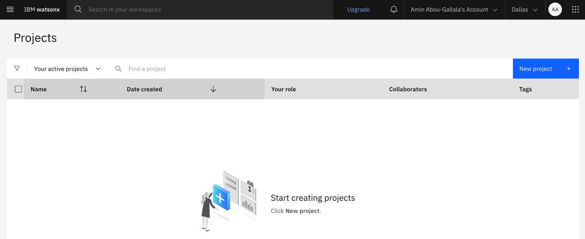

3. On the left, select **Local file**. Upload the Project file (`Batch-flow-lab.zip`).

   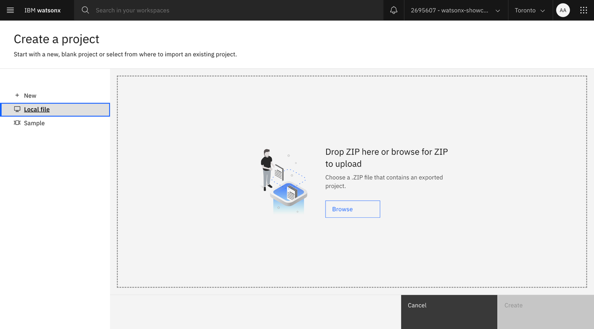

4. Create a unique name for the project (i.e. `Batch flow Lab- <Your Initials Here>`).

   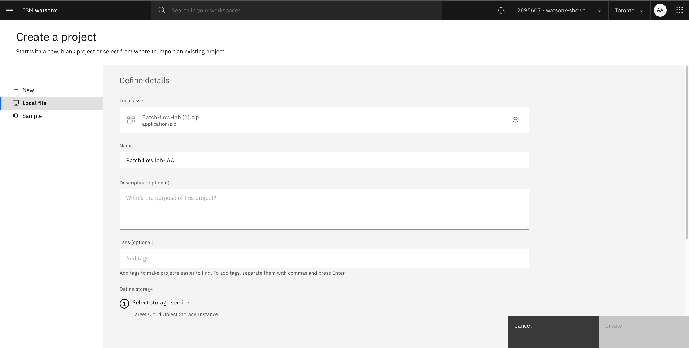

5. Select the Cloud Object Storage service (`cos-wxd-premium-project-bucket`), then click **Create**.

   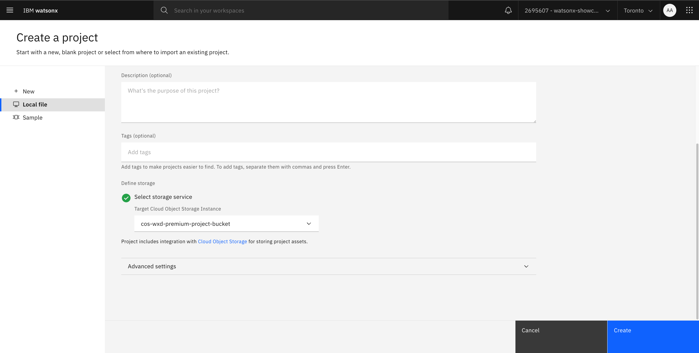

> Your project is now created successfully!

   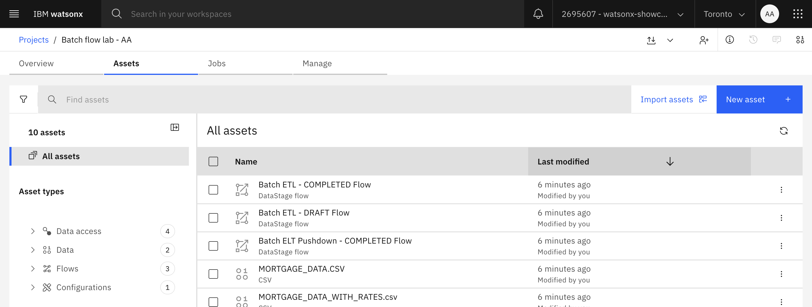

---

### 3.2 Walkthrough of the created project

DataStage flows are the design-time assets that contain data integration logic. The basic building blocks of a flow are:

- Data sources that read data
- Stages that transform the data
- Data targets that write data
- Links that connect the sources, stages, and targets

This lab is comprised of two DataStage flows in the project, a **DRAFT Flow** and a **COMPLETED Flow**.

- The **DRAFT Flow** is the starting point for walking through the core capabilities of DataStage.
- The **COMPLETED Flow** is the final output of the lab, allowing you to have a reference example or a backup Flow in case you are having issues building the completed flow manually.

1. Rename these DataStage flows to include your initials. This will help in identifying your assets in other integrations or add-on demo capabilities.

   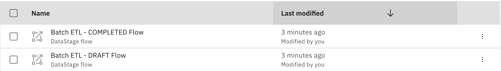

   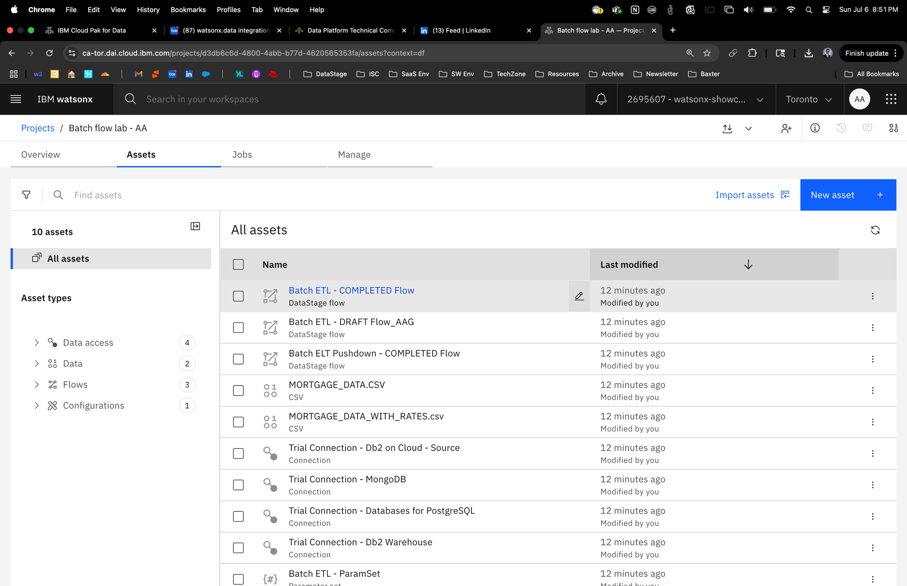

   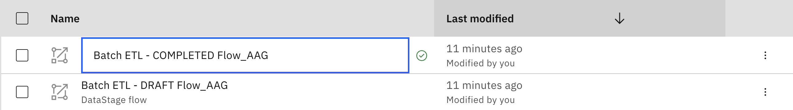

2. Click into the DRAFT Flow to get started authoring and running your batch ETL flow with DataStage!

---

## 4 Run an existing batch flow

The Batch ETL - DRAFT Flow joins the Mortgage Applicants and Mortgage Applications tables that are stored in Db2 Warehouse, filters the data to those records from the State of California, and creates a sequential file in CSV format as the output.

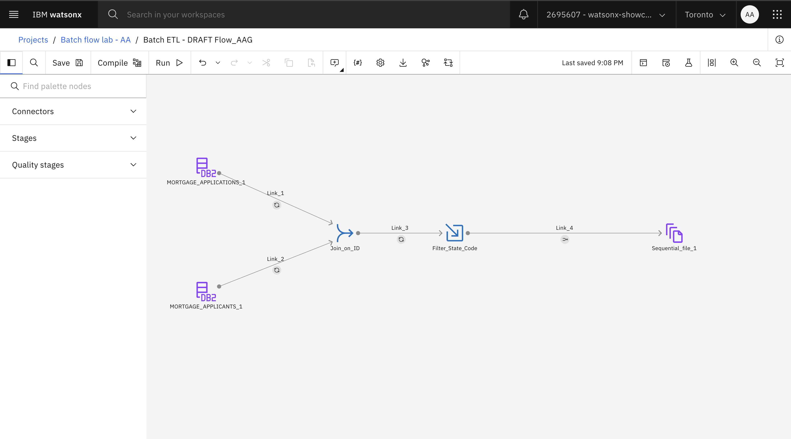

1. Click the zoom in icon  / zoom out icon  on the toolbar to set your preferred view of the canvas.
2. Double-click **MORTGAGE_APPLICATIONS_1** node to view the settings.
   - a. Expand the Properties section.
   - b. Scroll down to the bottom, then click **Preview data**. This data set includes information that is captured on a mortgage application.
   - c. Click **Close**.
3. Double-click **MORTGAGE_APPLICANTS_1** node to view the settings.
   - a. Expand the Properties section.
   - b. Scroll down, and click **Preview data**. This data set includes information about mortgage applicants who applied for a loan.
   - c. Optional: Visualize the data.
     - i. Click the Chart panel.
     - ii. In the Columns to visualize list, select **STATE**.
     - iii. Click **Visualize data** to see a pie chart showing the distribution of the data by state.
     - iv. Click the **Treemap** icon to see the same data in a treemap chart.
   - d. Click **Close**.
4. Double-click **Join_on_ID** node to view the settings.
   - a. Expand the Properties section.
   - b. Note that the join key is the ID column.

   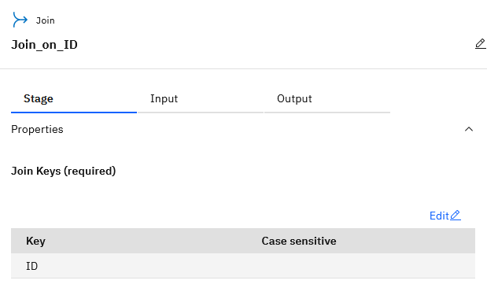

   - c. Click **Cancel** to close the settings.
5. Click **Compile**, and then click **Run**. Alternatively, you can click **Run** which compiles and then runs the DataStage flow. The run can take about a few minutes to complete.
6. Click the **Logs** icon  on the toolbar so you can watch the flow's progress. 
7. View the logs. You can use the total rows and rows/sec for each step in the flow to visually verify that the filter is working as expected.
8. When the run completes successfully, click **Batch flow lab – \<Your Initials\>** (your project name may differ) in the navigation trail to return to the project.

   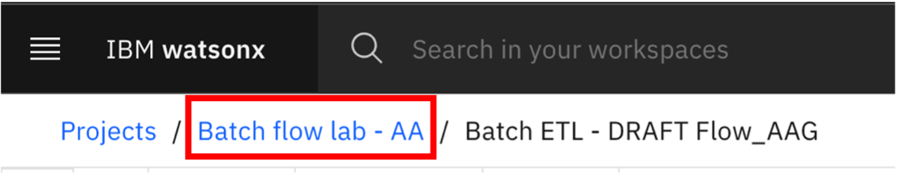
9. On the **Assets** tab, click **Data > Data assets**.
10. Open the `MORTGAGE_DATA.CSV` file. You can see that this file contains the columns from both the mortgage applicants and mortgage applications data sets.

---

### 4.1 Check your progress

The following image shows resulting CSV file. The next task is to edit the DataStage flow.

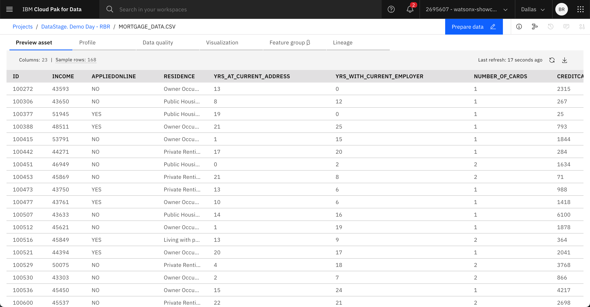

---

## 5 Edit the batch flow

Now that you joined the mortgage applicant and application data, you are ready to edit the DataStage flow to:

1. Specify a key column for the Join stage.
2. Add credit score data from a PostgreSQL database.
3. Add a Join stage to join the credit score data with the applicant and application data.
4. Add a Transformer stage to calculate total debt.
5. Add interest rate data from a MongoDB database.
6. Add a Lookup stage to look up interest rates for applicants based on their credit scores and Golden Bank's daily interest rate ranges.

> **Explainer - DataStage Stages**
>
> A DataStage flow consists of stages that are linked together, which describe the flow of data from a data source to a data target. A stage describes a data source, a processing step, or a target system. The stage also defines the processing logic that moves the data from the input links to the output links.
>
> A stage usually has at least one data input or one data output. However, some stages can accept more than one data input, and output to more than one stage. The following documentation [link](https://www.ibm.com/docs/en/cloud-paks/cp-data/5.4.x?topic=flows-datastage-stages) lists the available stages and gives details on their functions.

---

### 5.1 Specify the key column for the Join stage

Identifying a key column indicates to DataStage that column contains unique values. The Join_on_ID node joins the mortgage applicants and mortgage applications data sets using the ID column for the join key. The next phase is to join the resulting data set with the credit score data. Later, you will join the resulting filtered data with the credit score data set. The second join will use the EMAIL_ADDRESS column as the join key. In this task, you edit the DataStage flow to specify the EMAIL_ADDRESS column as the key column for the resulting data set when it is joined with the credit score data.

The following images provide a visual representation as an alternative to the description of the two join nodes.

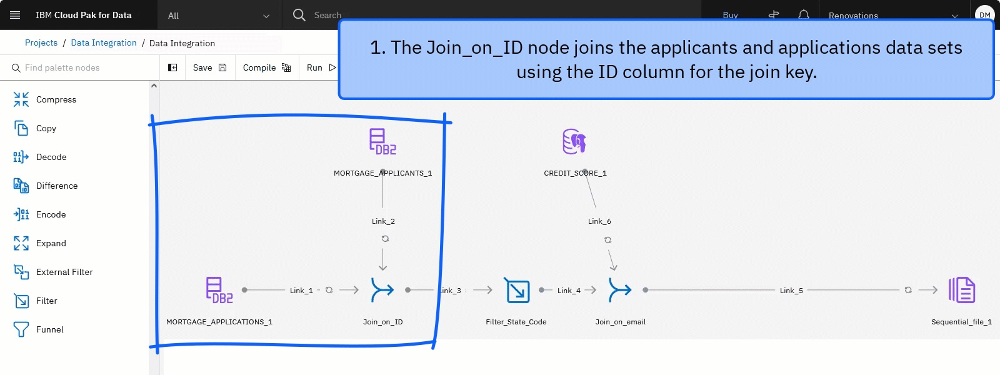

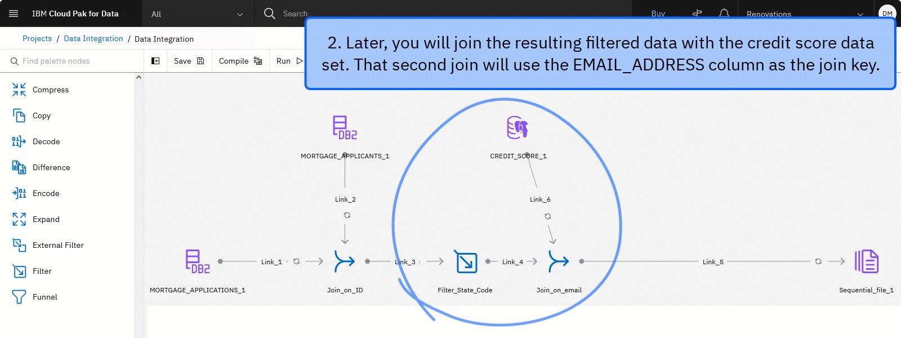

1. Click **DataStage Core Lab\_\<Your Initials\>** (your project name may differ) in the navigation trail to return to the project.

   

1. On the **Assets** tab, click **Flows > DataStage flows**.
2. Open the **Batch ETL DRAFT Flow\_\<your initials\>** flow.
3. Double-click the **Join_on_ID** node to edit the settings.
4. Click the **Output** tab, and expand the **Columns** section to see a list of the columns in the joined data set.
5. Click **Edit**.
6. For the **EMAIL_ADDRESS** column name, select **Key**.
7. Click **Apply and return** to return to the Join_on_ID node settings.
8. Click **Save** to save the Join_on_ID node settings.

> **Check your progress**
>
> The following image shows the DataStage flow with the edited Join_on_id stage. Now that you identified the EMAIL_ADDRESS column as the key column, you can add the PostgreSQL data containing the applicants credit scores.

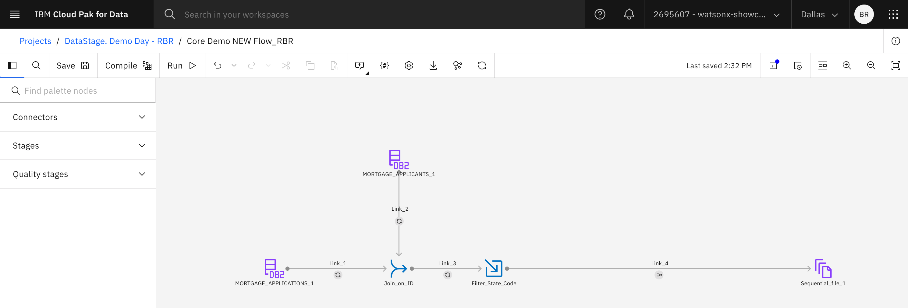

---

### 5.2 Add credit score data from a PostgreSQL database

> **Explainer - Asset Browser for DataStage**
>
> The Asset browser is used to search for connections and assets and add them to your DataStage flows. When you open the asset browser from the palette, you can use it to browse connectors, DataStage subflows, and data assets (.csv, .txt, .xls., .xlsx, .xml, .json files). The data can then be previewed before being onboarded to the DataStage flow – this feature saves developers time searching for the right data and is an important benefit as part of the modernization.

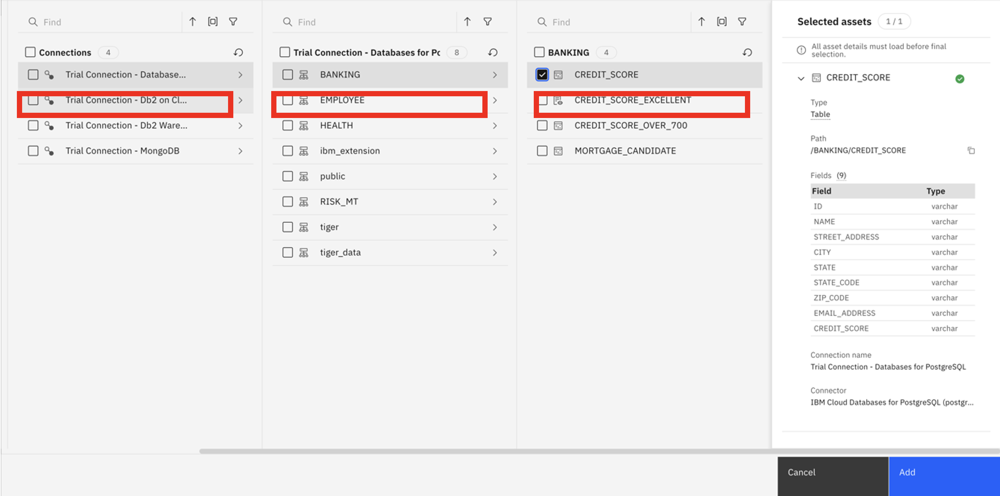

Follow these steps to add the credit score data that is stored in a PostgreSQL database to the DataStage flow:

1. In the node palette, expand the **Connectors** section.
2. Drag the **Asset browser** connector to the canvas beside the MORTGAGE_APPLICANTS_1 node.
3. Locate the asset by selecting **Connection > Trial Connection - Databases for PostgreSQL > BANKING > CREDIT_SCORE**.

   > **Note:** Click the connection or schema name instead of the checkbox to expand the connection and schema.

   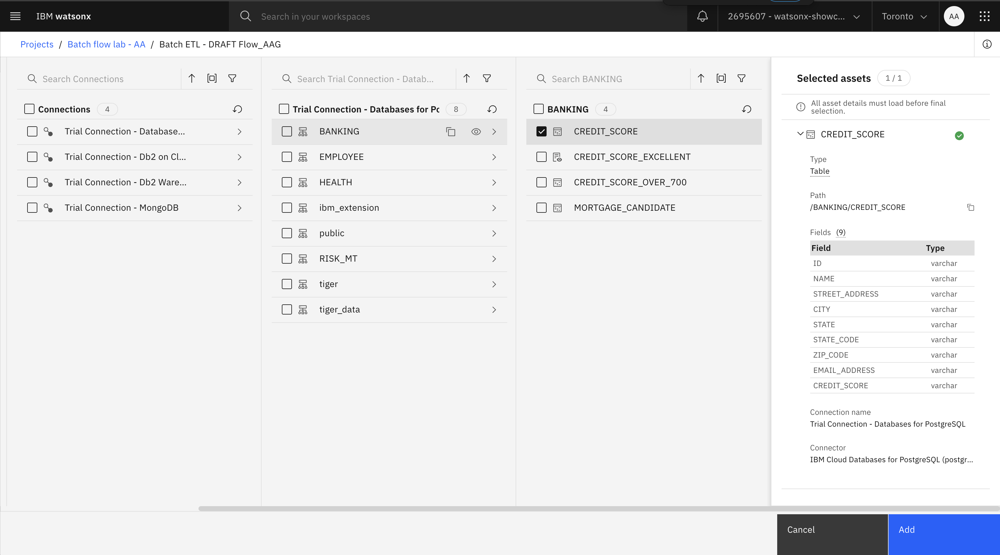

4. Click the **Preview**  icon to preview the credit score data for each applicant.
5. Click **Add**.

> **Check your progress**
>
> The following image shows the DataStage flow with the credit score asset added. Now that you added the credit score data to the canvas, you need to join the applicant, application, and credit score data.

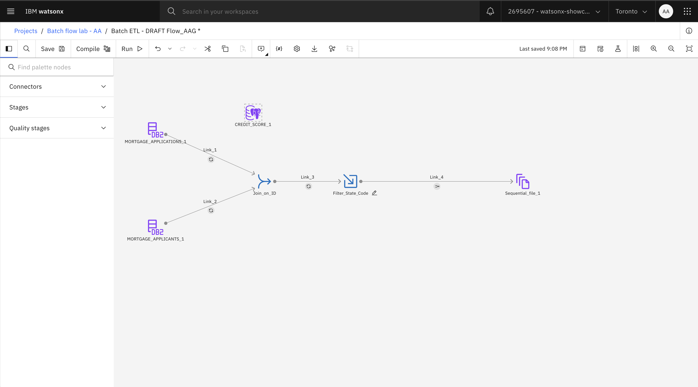

---

### 5.3 Add a Join stage to join the credit score data with the applicant and application data

Follow these steps to add another Join stage to join the filtered mortgage application and mortgage applicant joined data with the credit score data in the DataStage flow:

1. In the node palette, expand the **Stages** section.
2. Drag the **Join** stage on to the canvas, and drop the node on the link line between the Filter_State_Code and Sequential_file_1 nodes.
3. Hover over the **CREDIT_SCORE_1** connector to see the arrow. Connect the arrow to the Join stage.
4. Double-click the **CREDIT_SCORE_1** node to edit the settings.
   - a. Click the **Output** tab, and expand the **Columns** section to see a list of the columns in the joined data set.
   - b. Click **Edit**.
   - c. For the **EMAIL_ADDRESS** and **CREDIT_SCORE** column names, select **Key**.
   - d. Click **Apply and return** to return to the CREDIT_SCORE_1 node settings.
   - e. Click **Save** to save the CREDIT_SCORE_1 node settings.
5. Double-click the **Join_1** node to edit the settings.
   - a. Expand the **Properties** section.
   - b. Click **Add key**.
     - i. Click **Add key** again.
     - ii. Select **EMAIL_ADDRESS** from the list of possible keys.
     - iii. Click **Apply**.

   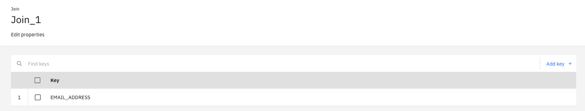

   - c. Click **Apply and return** to return to the Join_1 node settings.
   - d. Change the Join_1 node name to `Join_on_email`.
   - e. Click **Save** to save the Join_1 node settings.

> **Check your progress**
>
> The following image shows the DataStage flow with a second Join stage added. Now that you joined the application, applicant, and credit score data, you need to add a Transformer stage to calculate each applicant's total debt.

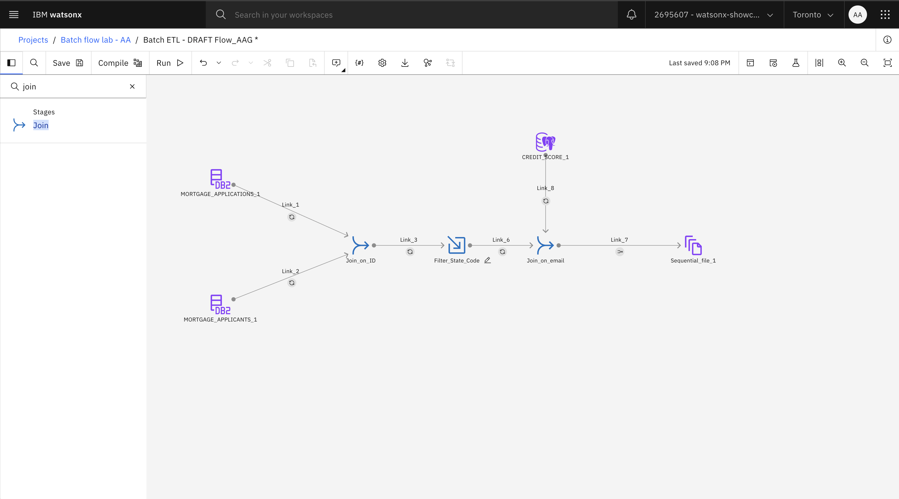

---

### 5.4 Add a Transformer stage to calculate total debt

Follow these steps to add a Transformer stage that creates a new column by summing the LOAN_AMOUNT and CREDITCARD_DEBT columns:

1. In the **Stages** section, drag the **Transformer** stage on to the canvas, and drop the node on the link line between the Join_on_email and Sequential_file_1 nodes.
2. Double-click the **Transformer** node to edit the settings.
3. Click the **Output** tab.
   - a. Click **Add column**.
   - b. Scroll down in the list of columns to see the new column.
   - c. Name the column `TOTAL_DEBT`.
   - d. Click the **Edit**  icon in the row's Derivation column.
   - e. Click the **Calculator**  icon in the Derivation column to open the expression builder.

   - f. Search for `LOAN_AMOUNT`, and double-click the column name to add it to the expression. Note that the link number is appended to the column name.
   - g. Type a plus sign `+`.
   - h. Search for `CREDITCARD_DEBT`, and then double-click the column name to add it to the expression. Note that the link number is appended to the column name.
   - i. Verify that the final expression is `Link_7.LOAN_AMOUNT + Link_7.CREDITCARD_DEBT`.

     > **Note:** Your link number may be different.

   - j. Click **Apply and return** to return to the Transformer page. If you see an error, change the column Data type to `nvarchar`.

   - k. For the **CREDIT_SCORE** column name, scroll to the right and select **Key**.
4. Click the **Stage** tab.
   - a. Select the **Advanced** page.
   - b. Change the **Execution mode** to **Sequential**.

5. Click **Save and return** to return to the canvas.

> **Check your progress**
>
> The following image shows the DataStage flow with the Transformer stage added. Now that you calculated each applicant's total debt, you need to add the table of interest rates to offer based on credit score ranges.

   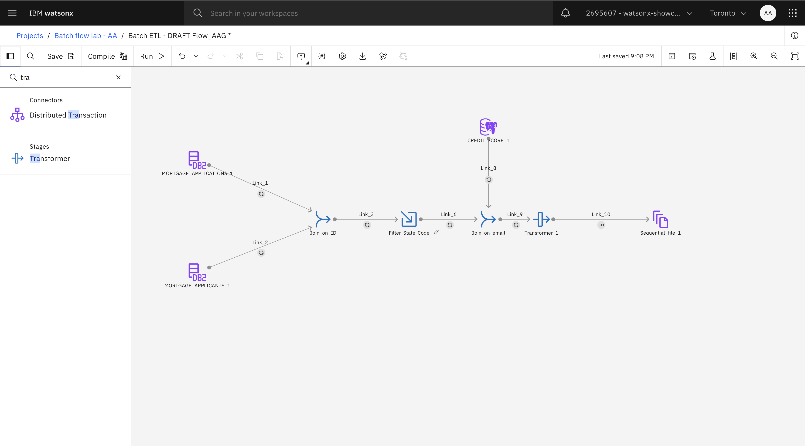

---

### 5.5 Add interest rate data from a MongoDB database

Follow these steps to include the interest rates in the flow by adding a data asset connector to a MongoDB database:

1. In the node palette, expand the **Connectors** section.
2. Drag the **Asset browser** connector on to the canvas beside the CREDIT_SCORE_1 node.
3. Locate the asset by selecting **Connection > Trial Connection - Mongo DB > DOCUMENT > DS_INTEREST_RATES**.

   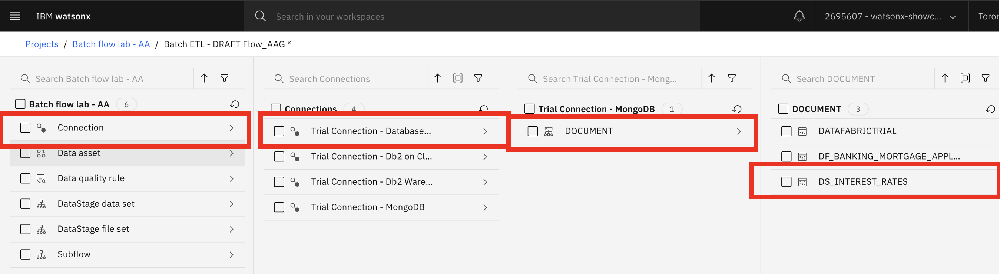

4. Click the **Preview** icon  to preview interest rates for each credit score range.

   You can use the values in the STARTING_LIMIT and ENDING_LIMIT columns to look up the appropriate interest rate based on the applicant's credit score. The ID column is not needed, so you will delete that column in the next step.

5. Click **Add**.

> **Check your progress**
>
> The following image shows the DataStage flow with the interest rates data asset added from the MongoDB external source. Now that you added the interest rates table, you can look up the appropriate interest rate for each applicant.

   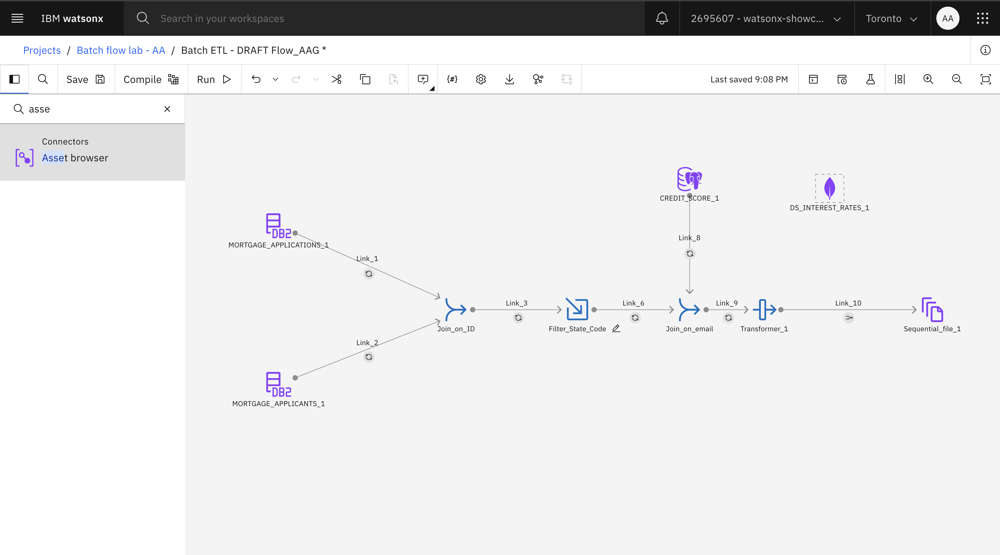

---

### 5.6 Add a Lookup stage to look up interest rates for applicants

Based on each applicant's credit score, you want to look up the appropriate interest rate. Follow these steps to add a Lookup stage and specify the range for starting and ending credit score limits for each interest rate:

1. In the **Stages** section, drag the **Lookup** stage on to the canvas, and drop the node on the link line between the Transformer_1 and Sequential_file_1 nodes.
2. Connect the **DS_INTEREST_RATES_1** connector to the Lookup_1 stage.
3. Double-click the **DS_INTEREST_RATES_1** node to edit the settings.
4. Click the **Output** tab.
   - a. Expand the **Columns** section, and click **Edit**.
   - b. Select the `_ID` column.
   - c. Click the **Delete** icon  to delete the `_ID` column.

   - d. Click **Apply and return** to return to the DS_INTEREST_RATES_1 node settings.

   - e. Click **Save** to save the changes to the DS_INTEREST_RATES_1 node.
5. Double-click the **Lookup_1** node to edit the settings.
6. Expand the **Properties** section.
   - a. For the **Apply range to columns** field, select `CREDIT_SCORE`. The Reference Links, Operator, and Range column fields display.
   - b. For the **Reference Links**, select `Link_9`.

     > **Note:** Your link number may be different.

   - c. For the first **Operator**, select `<=`.
   - d. For the first **Range column**, select `ENDING_LIMIT`.
   - e. For the second **Operator**, select `>=`.
   - f. For the second **Range column**, select `STARTING_LIMIT`.

   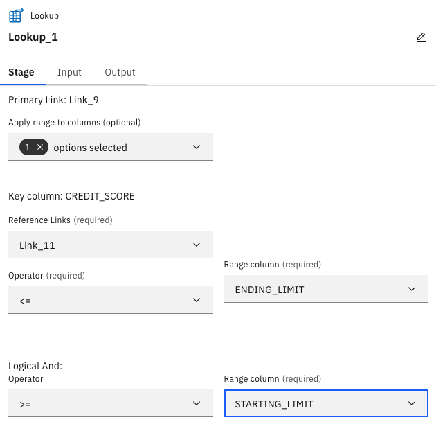

7. Click the **Output** tab.
   - a. Expand the **Columns** section, and click **Edit**.
   - b. Select the **STARTING_LIMIT** and **ENDING_LIMIT** columns.
   - c. Click the **Delete** icon  to delete these unnecessary STARTING_LIMIT and ENDING_LIMIT columns.
   - d. Click **Apply and return** to return to the Lookup_1 node settings.
   - e. Click **Save** to save the changes to the Lookup_1 node.

> **Explainer - Column metadata change propagation**
>
> When you add/remove columns or change a column's metadata, Column metadata change propagation automatically propagates these changes downstream. For example, when the STARTING_LIMIT and ENDING_LIMIT columns were deleted, these changes are propagated to the output Sequential File automatically, so those columns will not be seen as a part of the input.
>
> **Note:** Changes made upstream do not apply to a column once you modify its metadata. If you delete a column, modifying the column in a later stage will not add the column back.

8. Use the **Arrange Horizontally** button to automatically re-organize and arrange your stages neatly.

   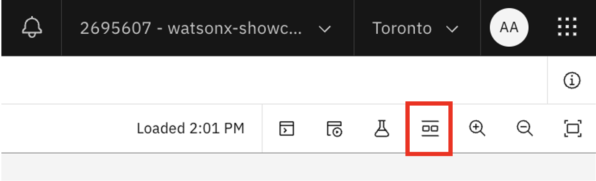

> **Check your progress**
>
> The following image shows the DataStage flow with the Lookup stage added. The DataStage flow is now complete. The last task before running the flow is to specify the name for the output file.

   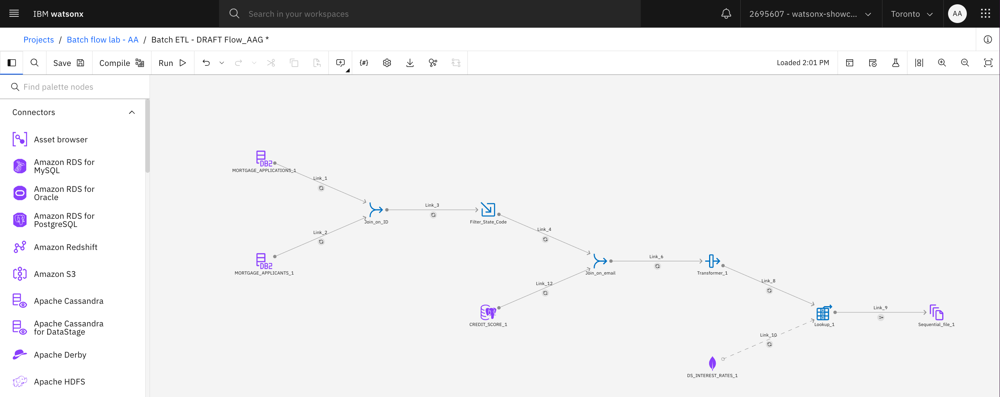

---

### 5.7 Edit the Sequential file node and run the DataStage flow

Follow these steps to edit the Sequential file node to create a final output file as a data asset in the project, and then compile and run the DataStage flow:

1. Double-click the **Sequential_file_1** node to edit the settings.
2. Click the **Input** tab.
3. Expand the **Properties** section.
4. For the **Target File**, copy and paste `MORTGAGE_APPLICANTS_INTEREST_RATES.CSV` for the file name.
5. Select **Create data asset**.
6. For the **First line is column names** field, select **True**.
7. Click **Save**.
8. Click **Run** which compiles and then runs the DataStage flow. The job takes about a few minutes to complete.
9. Click **Logs** on the toolbar to watch the flow's progress. It is normal to see warnings during the run, and then you see that the flow ran successfully.

> **Check your progress**
>
> The following image shows that the DataStage flow ran successfully!

   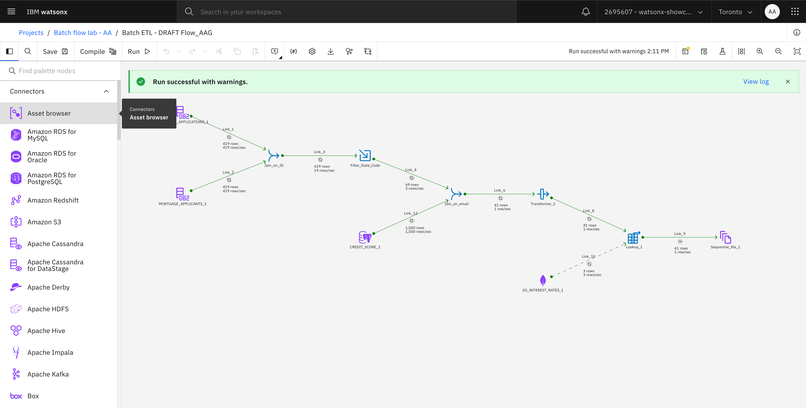

10. Go back into your project assets by clicking the **Project** link.

   

11. Look for the `MORTGAGE_DATA.csv` asset.

   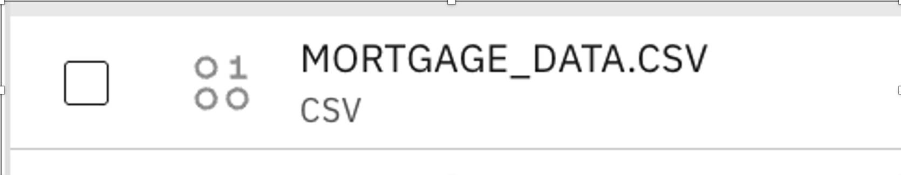

> **Expected output:**
>
> Congratulations! You have now successfully authored a DataStage flow that ingests and joins mortgage application data from different tables, filters the data based on the state code of the applicant, and performs lookups based on the applicants' credit scores.

   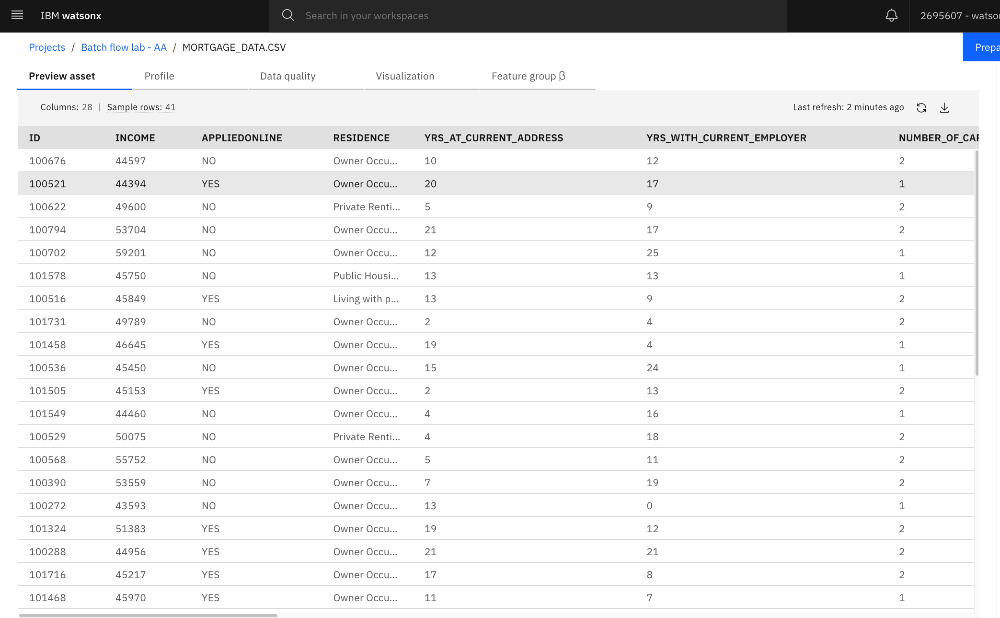

---

## 6 Create reusable batch data pipelines with parameters

You can use parameters and parameters sets in your jobs to specify information that your job requires at run time. Use job parameters to design flexible and reusable jobs. Instead of entering variable factors as part of the job design, you can create parameters that represent processing variables. When you run the job, you are prompted to select values for each of the parameters that you define. You can supply default values for parameters, which are used unless another value is specified when the job runs.

Follow these steps to create and use parameters in your existing flow. You'll insert parameters in your flow to specify values at run time, rather than hardcoding the values. Specifying the value of the parameter each time that you run the job ensures that you use the correct resources, such as the database to connect to and the file name to reference.

In this section, you will:

- Create a parameter set that parameterizes 2 components of the pipeline:
  - `FilteredStateCode`: Specify the State Code for filtering the data.
  - `OutputFileName`: A file name for the final CSV output in your sequential file stage.
- Edit the Filter stage and the Sequential File Stage in the existing flow to add these parameters.
- Specify values for the parameters within the Run settings of the flow and view the results.
- Edit the created Parameter Set in your project and standardize frequently used values for the parameters using Value Sets:
  - Create 2 Value Sets inside the Parameter Set for CA and TX.
- Specify one of these value sets in the Run settings.

---

### 6.1 Create a parameter set

1. To start, go back to your project and click on the blue **New Asset** box to create your parameter set.

   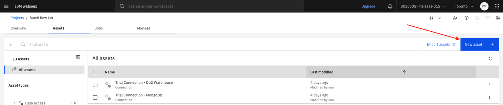

   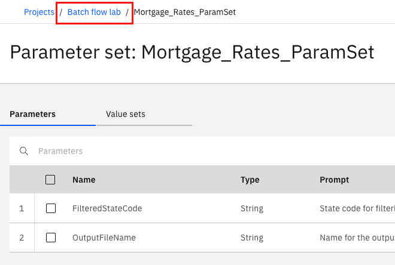

2. Type `parameter` in the search box to click the **Parameter Set** asset.

   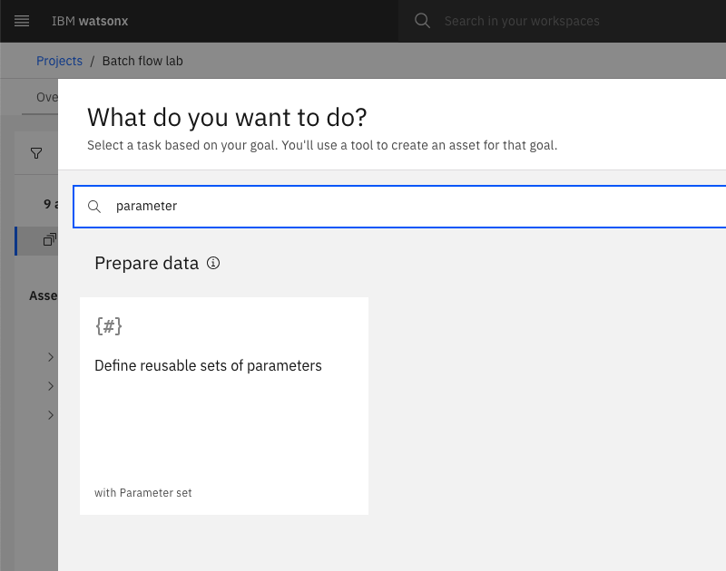

3. Create a parameter set called `Mortgage_Rates_ParamSet`.

   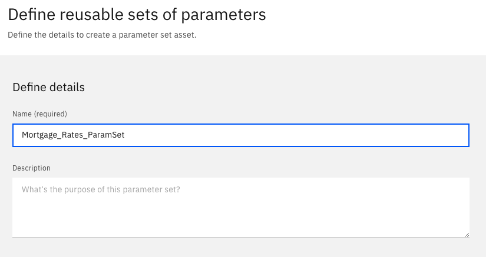

4. Create two parameters under this parameter set – one for filtering on the state code and the other for specifying the output file name:
   - a. Parameter Name: `FilteredStateCode`
     - i. Prompt: `State code for filtering applicants to a specific state.`
     - ii. Default Value: `CA`
   - b. Parameter Name: `OutputFileName`
     - i. Prompt: `Name for the outputted CSV file.`
     - ii. Default Value: `MORTGAGE_RATES_CA.csv`

   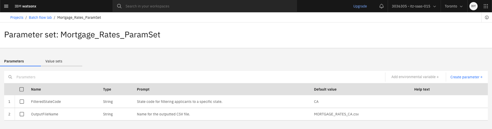

5. Click **'Save'**.

6. Click on the **'Batch flow lab'** breadcrumb at the top left of your screen to return to your project.

---

### 6.2 Use a parameter set inside a batch flow

1. Once you're back in your project, click on your **DRAFT** flow.

   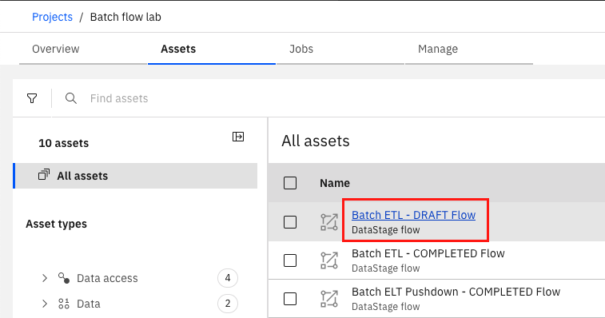

2. On the canvas, click on the **hashtag icon** next to the settings icon at the top of the canvas to add your new parameter set.

   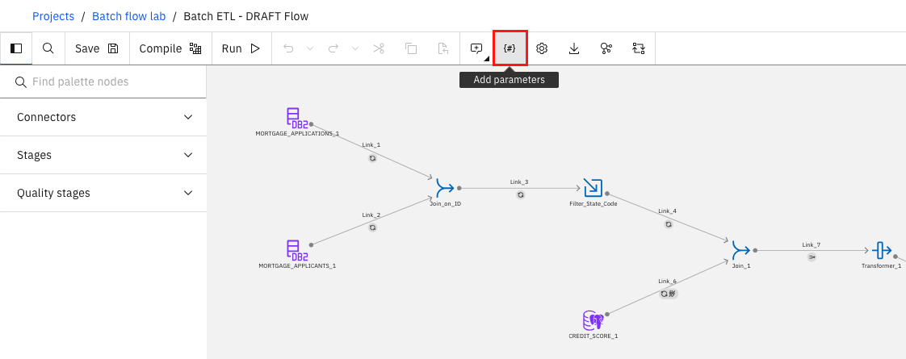

3. Click on the **Parameter sets** tab then click on the blue **'Add parameter set'** text on the far right.

   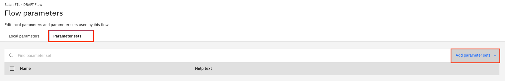

4. Check the box next to `Mortgage_Rates_ParamSet`, then click the blue **'Add'** box at the bottom right. Once complete, return to your canvas.

   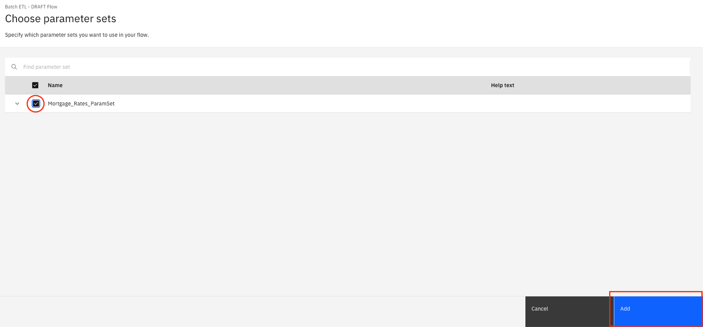

   The parameters inside the created parameter set can now be inserted within the pipeline.

5. On the canvas, double click on your **Filter** stage, then click to **'Edit'** under the Properties drop down to add the `FilteredStateCode` parameter.

   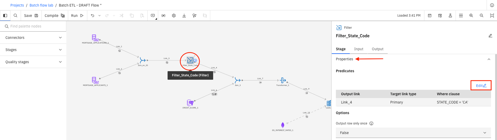

6. Click on the **calculator icon** to edit your expression.

   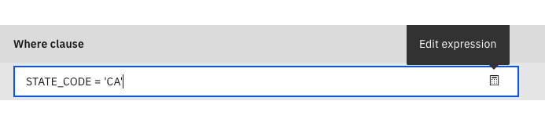

7. **IMPORTANT:** Delete the `'CA'` value in your existing WHERE clause, and place your cursor in-between the two quotes on the expression editor.

   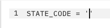

   Next, you can find your parameter by opening the drop-down menu on the left under Expression Elements. Now, double click on the FilteredStateCode parameter. This will copy/paste your parameter into the where clause, as shown below:
   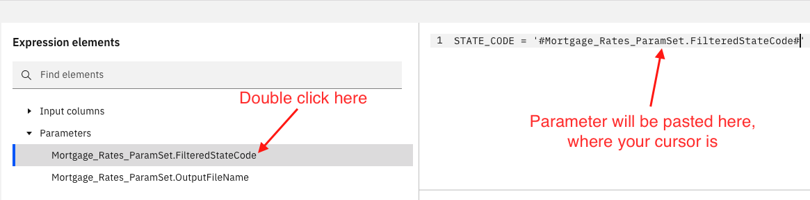

   Then, click **Apply and Return** to get out of the Filter_State_Code UI.

   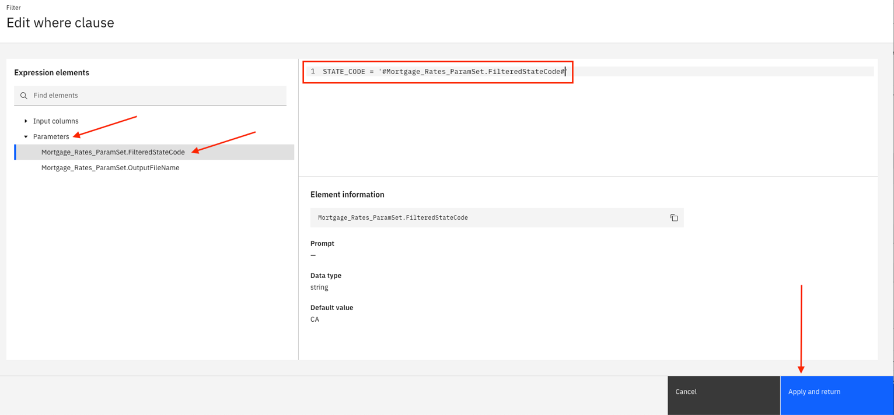

8.	Then, click Apply and Return to get out of the Filter_State_Code UI

    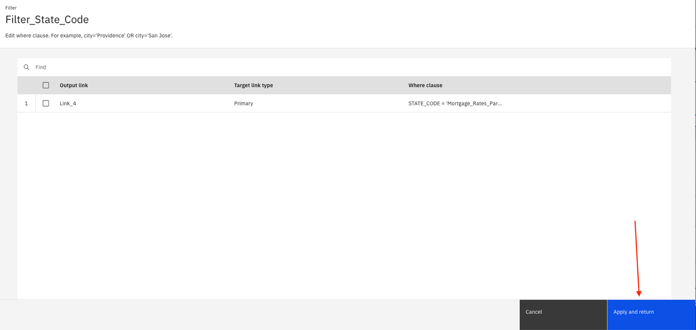

9. Save your changes to the Filter stage by clicking the blue **Save** button.

    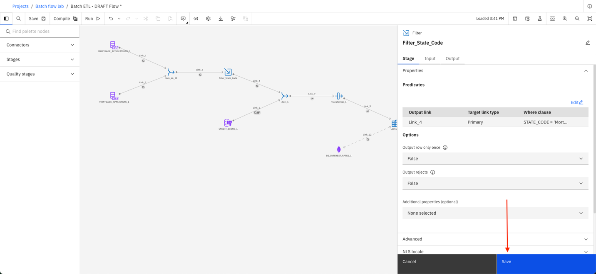

   Now, we'll do the same steps for the sequential file stage.

10. Double click on the **Sequential File** stage at the end of your flow, select the **Input** tab, then click on the **Properties** drop down to reveal details on your File, such as the file name.

    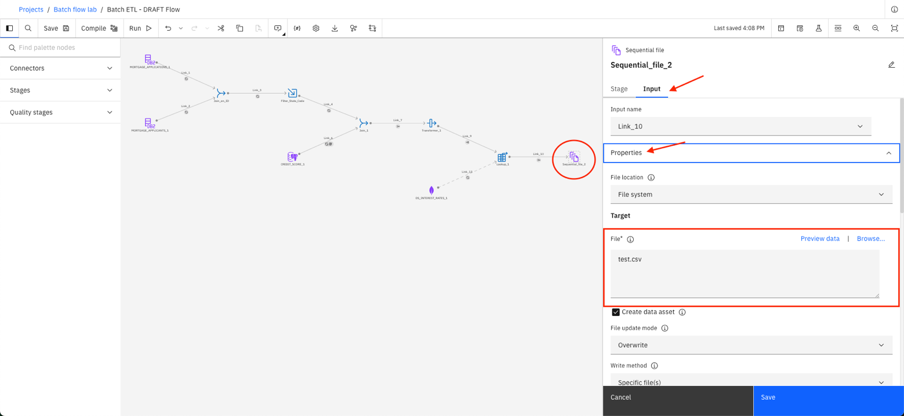

11. Delete your existing file name in the text entry box, then hover your mouse over the bottom right portion of the text entry box to click on the **Parameterize** button.

    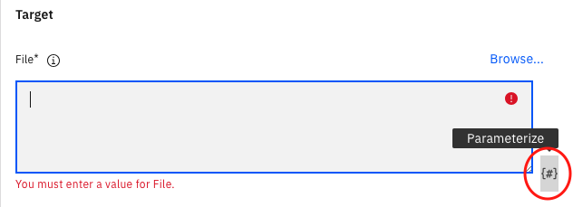

12. Select `Mortgage_Rates_ParamSet.OutputFileName`, then click the blue **Select** box at the bottom right.

    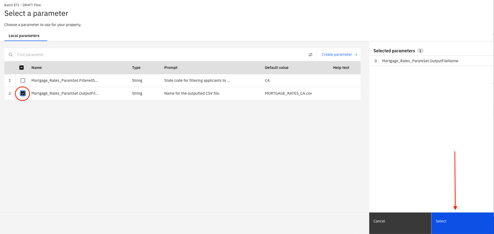

13. Once complete, save your changes to the sequential file stage by clicking the blue **Save** box.

    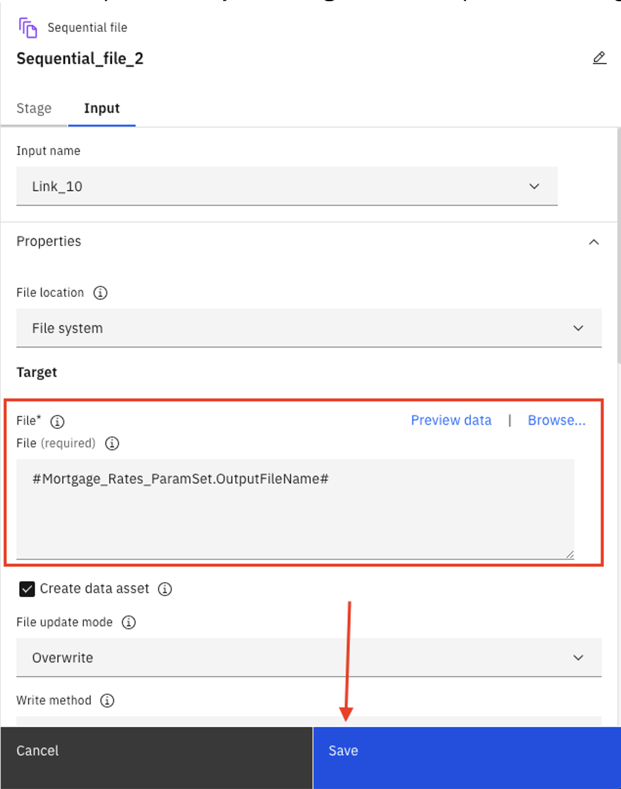

14. Next, click on the Settings icon at the top of your canvas 

    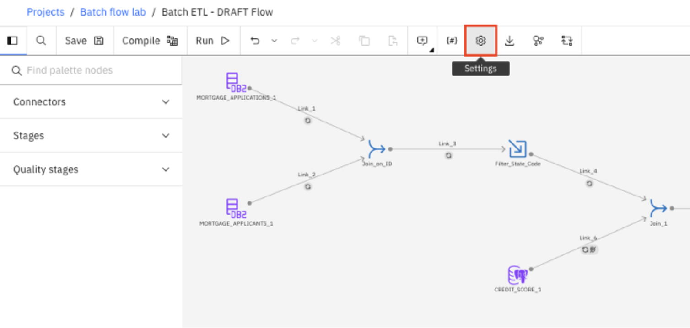

15. Navigate to the **Runtime parameter settings** on the left-hand side. This is where we'll edit the values for the parameters to be utilized at runtime.
    - a. Delete the default `CA` value and replace it with `TX` for `FilteredStateCode`.
    - b. Delete the default value of `MORTGAGE_RATES_CA.csv` and replace it with `MORTGAGE_RATES_TX.csv` for `OutputFileName`.

    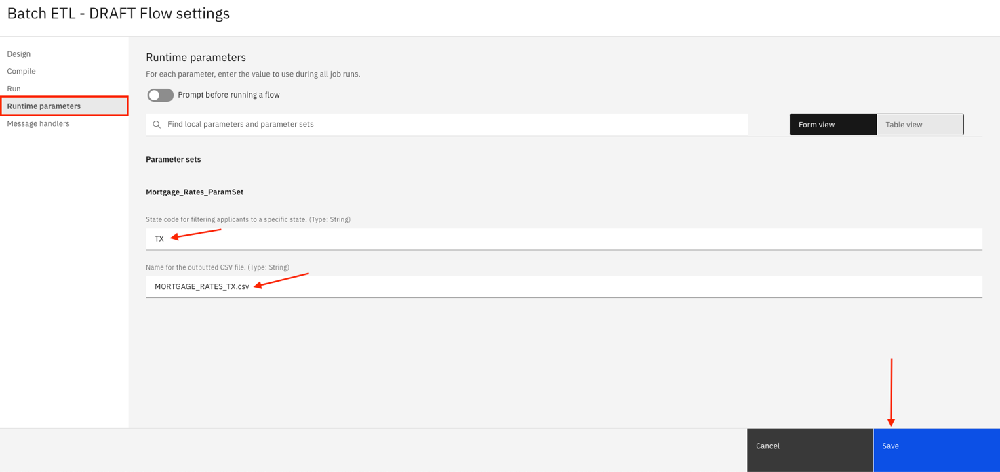

16. Once done, click the blue **save** box at the bottom right to return to the canvas. We are now ready to run the flow with these new Texas parameters.

17. Compile and run your flow, then view the output file in your project.

    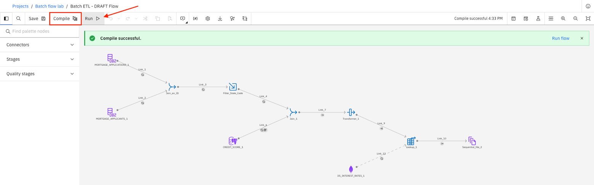

18. To get to the file in your project, click the **'Batch flow lab'** link at the top left of your screen.

    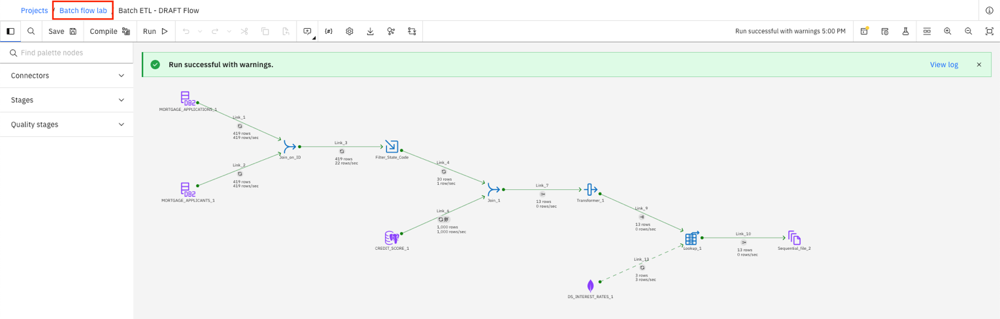

19. Once you're back in the project, you should see a `MORTGAGE_RATES_TX.csv` asset. Click on that asset to see the new data asset that was created from your DataStage flow.

    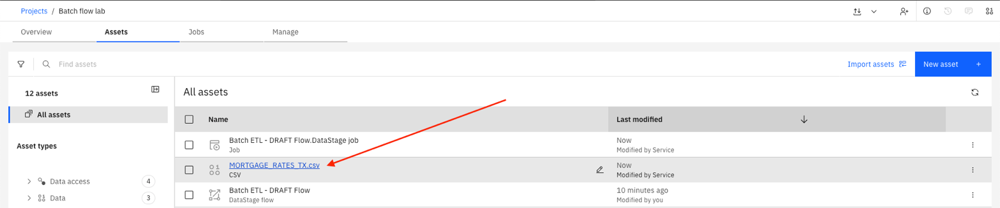

20. When viewing the file in your project, it should look like the following below:

    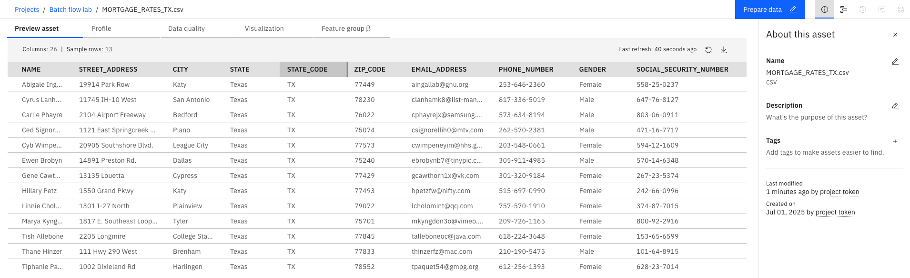

This batch ETL flow can now be invoked and re-utilized for different use cases using parameters without re-factoring or modifying the pipeline directly.

---

### 6.3 Standardize frequently used parameter values with value sets

In the mortgage processing batch flow used in this lab, there are 50 potential U.S. states that can be used to filter mortgage applicants and write each result to a separate file based on the state.

Since the parameter set includes two parameters per combination (e.g., `FilteredStateCode = "CA"`, `OutputFile = "MORTGAGE_RATES_CA.csv"`), this results in 50 combinations and 100 parameter values in total.

To avoid manually entering these values for each run, we can use value sets within parameter sets to predefine and standardize the combinations. This becomes especially valuable as the number of combinations and the number of parameters per combination increases.

1. Go back into your project by clicking the **'Batch flow lab'** project link.

   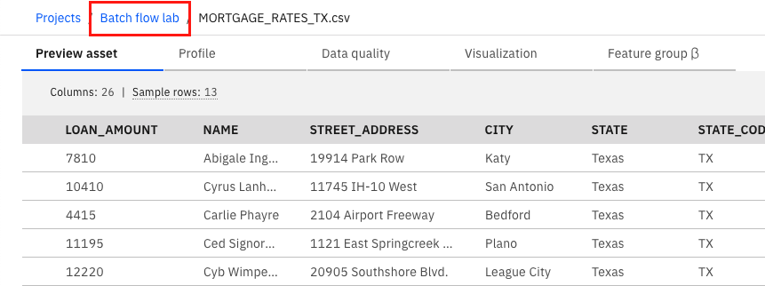

2. Within your project, click on the `Mortgage_Rates_ParamSet` asset created earlier.

   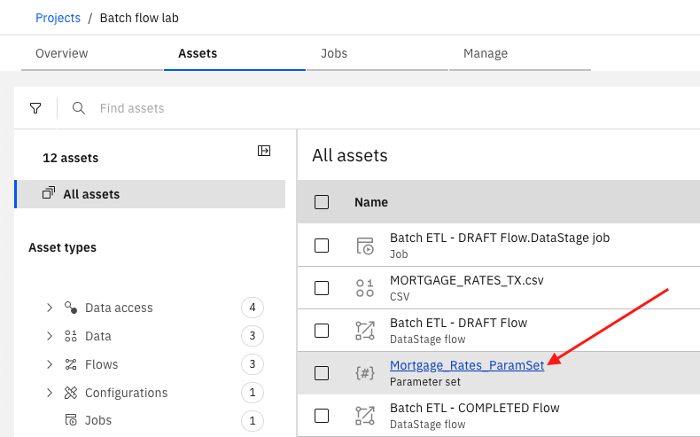

   Now, we'll create 2 value sets inside the parameter set for CA and TX.

3. Click on the **Value Set** tab, then click **create value set**.

   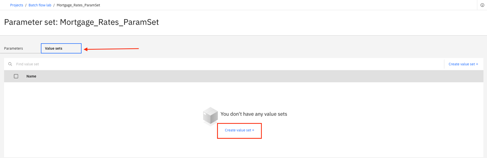

4. We'll name our first value set `'CA'` and input the following values, then click **Save**.
   - a. State code = `CA`
   - b. Output file = `MORTGAGE_RATES_CA.csv`

   

5. We'll name our second value set `'TX'` and input the following values, then click **Save**.
   - a. State code = `TX`
   - b. Output file = `MORTGAGE_RATES_TX.csv`

   

   > Your final output in the Value Set tab should look like this.

   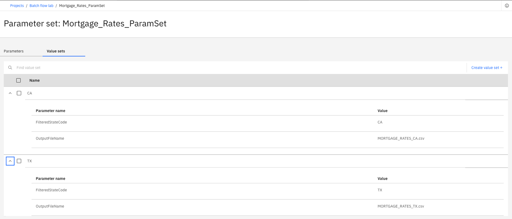

6. Click on the **'Batch flow lab'** link at the top left of your screen to return to your project.

   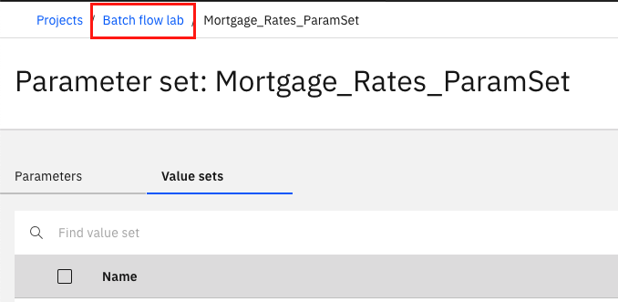

7. Click on your **DRAFT** flow asset.

   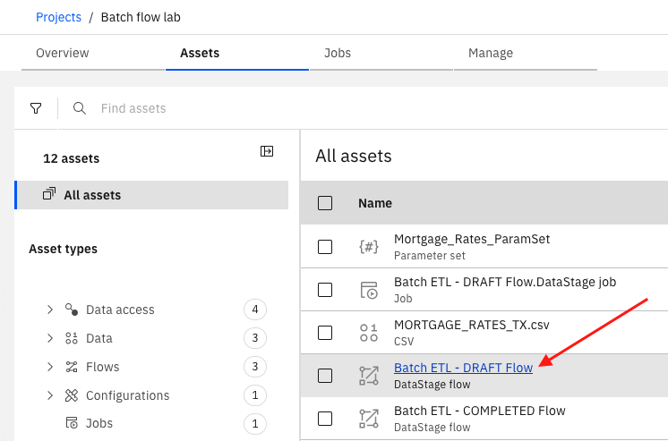

8. On the canvas, click on the **Settings** icon.

   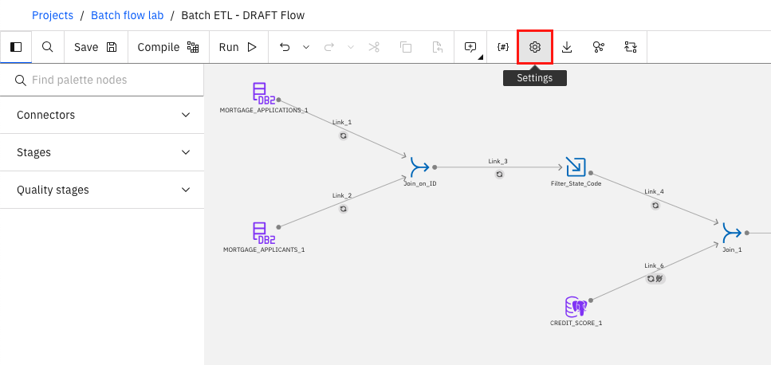

9. Click on the **Runtime parameters** menu on the left-hand side. Now, in the Runtime parameters, there will be a drop-down menu in the parameter sets section that will show your newly created Value Sets. You should now see options for Default, CA, or TX.

    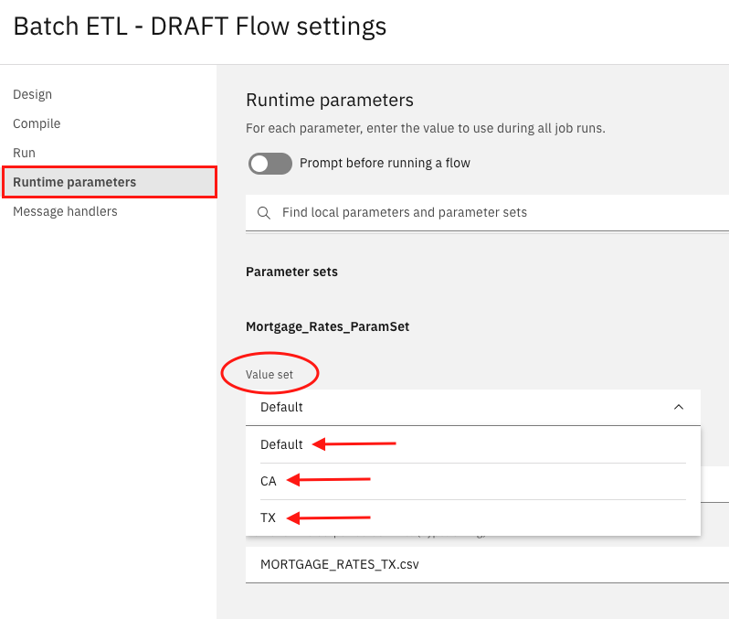

10. Since we already ran the flow once using the TX parameters, select the **CA** Value Set, then click the blue **Save** box at the bottom right.

    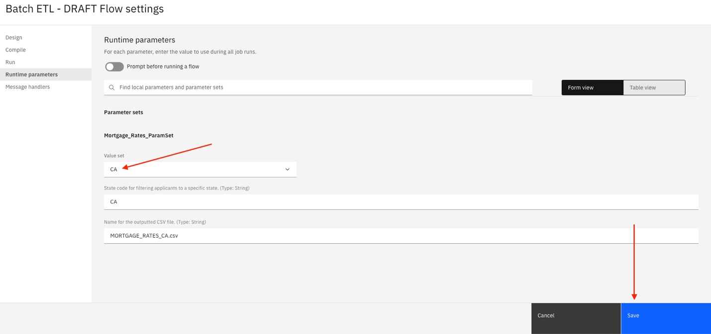

11. Now, you can compile and run your flow again with the CA value set and compare results in the `MORTGAGE_RATES_CA.csv` file.

    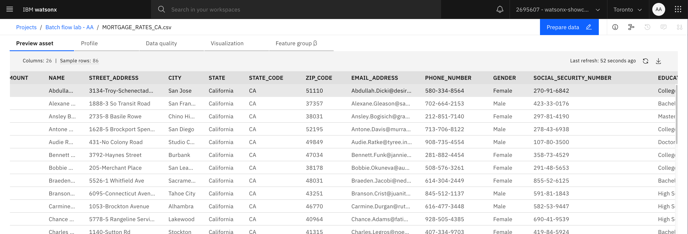

---

## 7 Conclusion and Next Steps

This lab demonstrated how to build a scalable, cloud-native, and reusable batch data pipeline using IBM DataStage within watsonx.data integration. From ingesting and transforming data across multiple sources to applying logic and writing parameterized outputs, the hands-on experience showcased the full lifecycle of modern ETL/ELT pipeline development. By leveraging the intuitive designer experience, parallel processing engine, and support for dynamic runtime configuration, organizations can confidently implement flexible and high-performance data integration pipelines across any cloud or on-premises environment.

**Key Features & Benefits**

| Feature | Description |
|---|---|
| **Design Once, Run Anywhere** | True hybrid cloud flexibility by allowing pipelines to be authored in a centralized control plane but executed locally in any VPC or cloud, minimizing egress costs and latency. |
| **Cloud-Native Architecture** | Reduce management complexity of existing data pipeline tools while providing true elasticity and auto-scaling for large-scale batch ETL/ELT jobs. |
| **No-code/Low-code canvas** | Simplify pipeline development and authoring at scale for users of all skill levels, reducing development time with a visual flow builder. |
| **Asset Browser** | Accelerate development by allowing users to search, preview, and onboard data assets directly into flows without switching into different tools. |
| **Support for Diverse Data Sources** | Seamlessly onboard and integrate from a variety of structured/semi-structured, IBM/non-IBM, modern/legacy data sources — simplifying complex, multi-cloud data integration. |
| **Column Metadata Change Propagation** | Automatically update downstream stages with schema changes, reducing manual rework and debugging during pipeline development. |
| **Parallel Engine Processing** | Best-in-class parallel processing engine that increases throughput by distributing processing across multiple nodes, ideal for scaling performance for large data volumes. |
| **Parameter Sets and Value Sets** | Promote pipeline reusability and standardization, allowing runtime customization of logic without re-factoring or re-designing existing pipelines. |

---

## 8 Lab Reference Materials

### 8.1 Helpful Links

- **DataStage Documentation**
  https://dataplatform.cloud.ibm.com/docs/content/dstage/dsnav/topics/datastage.html?context=df&audience=wdp

- **DataStage Documentation – Asset Browser**
  https://dataplatform.cloud.ibm.com/docs/content/dstage/dsnav/topics/asset_browser_connection.html?context=df&audience=wdp

- **DataStage Documentation – Supported data sources**
  https://dataplatform.cloud.ibm.com/docs/content/dstage/dsnav/topics/datastage-supported-conn.html?context=df&audience=wdp

- **DataStage Documentation – Parameters and Parameter Sets**
  https://dataplatform.cloud.ibm.com/docs/content/dstage/dsnav/topics/parameters-and-parameter-sets-parent.html?context=df&audience=wdp

- **DataStage Documentation – Gen AI Assistant**
  https://dataplatform.cloud.ibm.com/docs/content/dstage/dsnav/topics/using_the_datastage_assistant.html?context=df&audience=wdp
