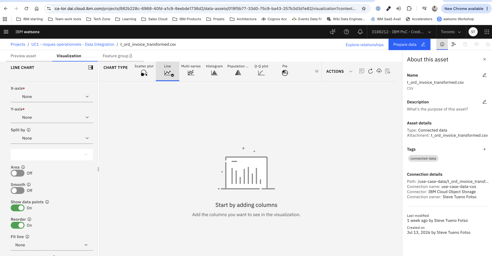

The aim is to build a lab to onboard IBM clients into usage of watsonx.data integration, especially StreamSets. For the lab, participants will be required to build a StreamSets pipeline that will connect to a confluent kafka topic, read EUR/USD currency exchange rates, compute the average exchange rate over a 3-hour window and save it to a watsonx.data presto table (`fx_eurusd_3h_avg`). Then they'll import the table into an IBM data platform project (https://ca-tor.dai.cloud.ibm.com/) and visualize the 3-hour average EUR/USD exchange rate in a graph such as 

first build a welcome root readme to welcome participants, introduce into the lab. Build a personna and narrative to help participants better understand the need.

Then in setup folder, build assets and provide instructions that a tutor should follow in an empty confluent cluster (), through control center, to set the fx_rates topic, define the schema, and set a ksqlDB flow to stream data from alphavantage(https://www.alphavantage.co/) to the topic (1 message per hour with the EUR/USD exchange rate). The instructions should be precise and snippets to copy precise so that at the end of the setup phase, tutor should have a properly configured confluent topic feed with the EUR/USD exchange rate every hour.