# Module 1 — Build the StreamSets Kafka-to-watsonx.data Pipeline

> **Audience:** Lab participant  
> **Duration:** ~60 minutes  
> **Prerequisites:** Your tutor has completed the [Confluent and watsonx.data setup](../setup/TUTOR_SETUP.md) and handed you the connection details sheet.

---

## Overview

In this module you will build a **StreamSets DataOps pipeline** that:

1. Reads Avro-encoded multi-currency exchange rate messages from the Confluent Kafka topic `fx_rates`
2. Promotes the Kafka broker timestamp from a record header attribute to a `DATETIME` field via an Expression Evaluator
3. Filters records down to only EUR/USD pairs using a Stream Selector
4. Writes the filtered records to a watsonx.data **Apache Iceberg** table through the **IBM Flight Service**

At the end of this module your pipeline will be running and the target table will be growing with each new EUR/USD tick (~2 records per minute on average, given 10×10 currency pairs and a 30-second interval).

### Pipeline architecture

```
Kafka Multitopic               Expression Evaluator        Stream Selector
Consumer                       ────────────────────  ───►  ───────────────
─────────────────────   ───►   timestamp attribute          from_currency == EUR
  topic: fx_rates               → /timestamp                to_currency   == USD
  format: Avro                  (DATETIME)                       │             │
  Schema Registry                                           matched       unmatched
  Include timestamps                                             │             │
                                                                 ▼             ▼
                                                     watsonx.data          Trash
                                                     ────────────
                                                     iceberg.fx_analytics
                                                     .fx_eurusd_<YOUR_INITIALS>
```

---

## Before You Start

Make sure you have the following from your tutor's connection details sheet:

| Item | Where it goes |
|------|--------------|
| Confluent bootstrap server (e.g. `pkc-abc12.us-east-1.aws.confluent.cloud:9092`) | Kafka Multitopic Consumer — Broker URI |
| Kafka username | `sasl.jaas.config` in Custom security properties |
| Kafka password | `sasl.jaas.config` in Custom security properties |
| Kafka CA certificate (`kafka-ca.crt`) | `ssl.truststore.certificates` in Custom security properties |
| Schema Registry URL (e.g. `https://163.66.85.93/sr`) | Kafka Multitopic Consumer — Schema registry URLs |
| Schema Registry username and password | Kafka Multitopic Consumer — Basic auth user info (`username:password`) |
| watsonx.data Engine ID | IBM watsonx.data stage — Engine ID |
| watsonx.data Engine Host | IBM watsonx.data stage — Engine Host |
| watsonx.data Engine Port | IBM watsonx.data stage — Engine Port |
| IBM Cloud API key | IBM watsonx.data stage — Credentials → API Key |

Keep this sheet open — you will copy values from it throughout this module.

---

## Step 1 — Log in to IBM Cloud and open the Data Fabric platform

### 1a — Sign in with your IBM ID

1. Open your browser and go to **[https://cloud.ibm.com](https://cloud.ibm.com)**.
2. Click **Log in** and enter your **IBM ID** (email) and password.
   If your organisation uses single sign-on (SSO), click **Continue with your company account** instead.

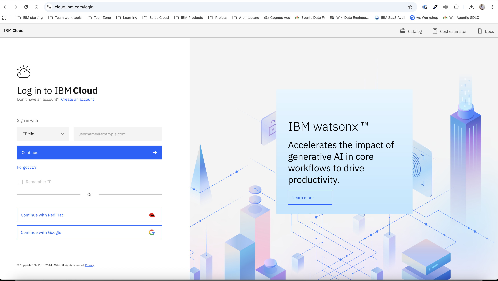

3. Once signed in you will land on the **IBM Cloud dashboard** showing your resource summary.

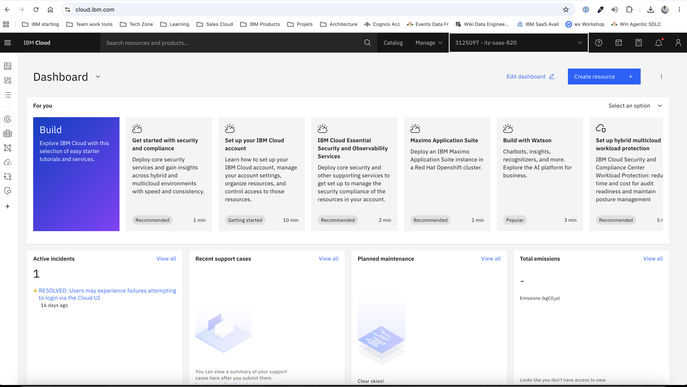

### 1b — Open the IBM Data platform

1. In the **same browser tab**, navigate to the [**IBM Data Platform**](https://ca-tor.dai.cloud.ibm.com/df/home?context=df).

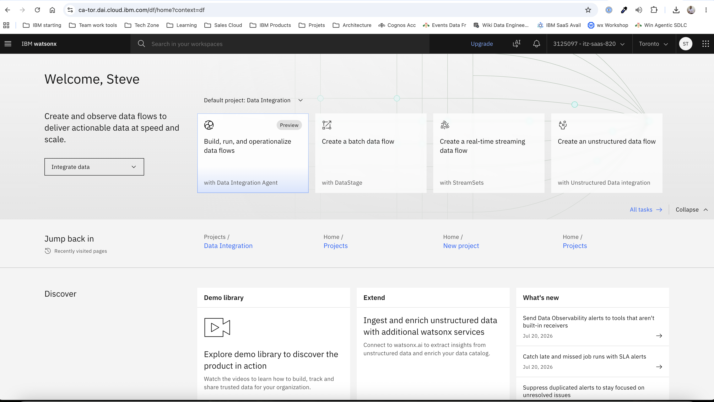

### 1c — Open the Data Integration project

1. In the top navigation bar, click **Projects**.

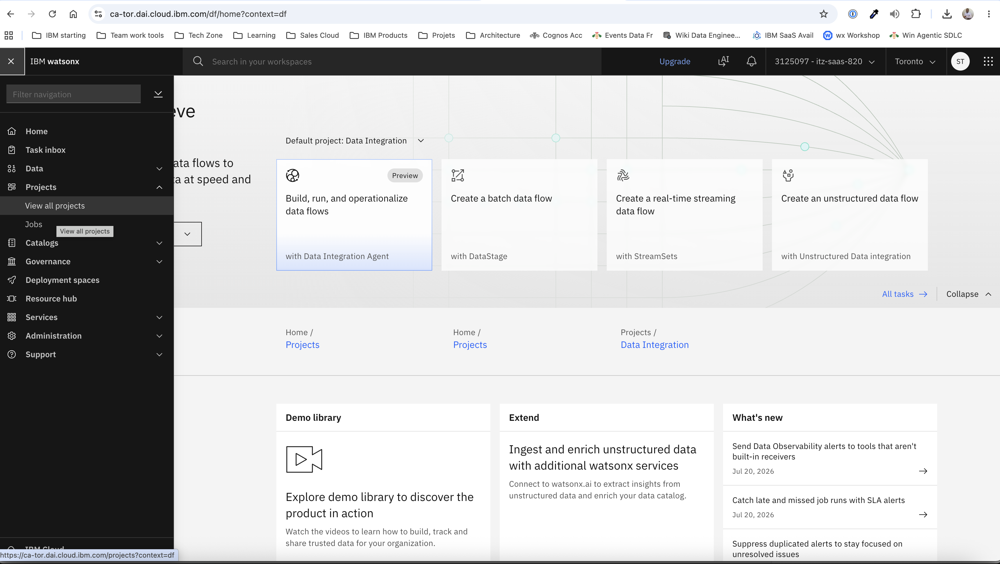

2. From the project list, click **Data Integration** (created by your tutor in the setup guide).

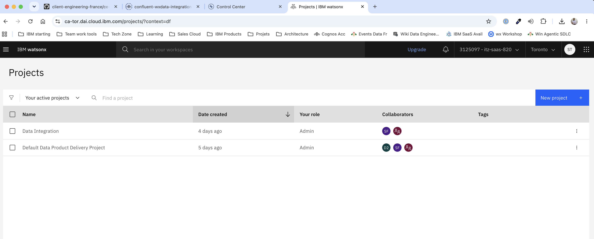

3. You will land on the **Data Integration** project home page, showing the **Assets** tab.

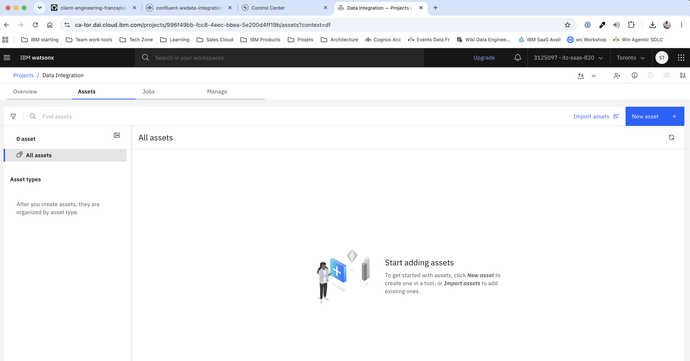

---

## Step 2 — Create a StreamSets Flow Asset

The StreamSets pipeline is created as a **Flow** asset inside the project. This links it to the StreamSets engine registered by your tutor and keeps everything in one governed workspace.

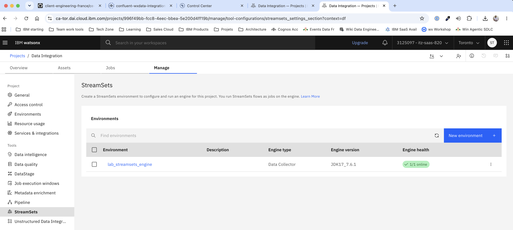

1. On the **Assets** tab, click **New asset +** (top-right corner).

2. In the popup, use the search box or browse to find **Create a real-time streaming data flow**. Click on the tile.

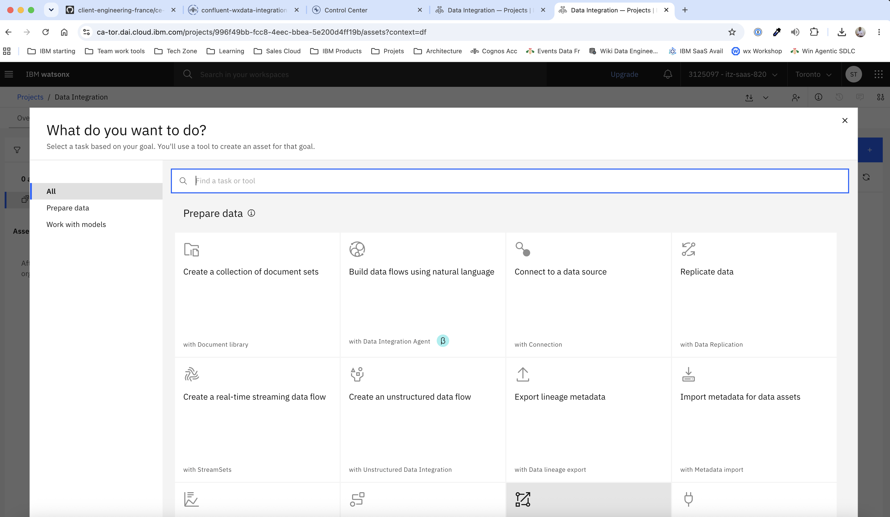

3. Fill in the asset creation form:

   | Field | Value |
   |-------|-------|
   | **Name** | `fx_eurusd_filter_<YOUR_INITIALS>` |
   | **Description** | `EUR/USD exchange rate filter — watsonx.data Integration lab` |

4. Under **Environment**, select the `lab_streamsets_engine` environment prepared by your tutor.


5. Click **Create**.

You will be taken directly into the **StreamSets pipeline canvas** — an embedded drag-and-drop editor inside the platform.


---

## Step 3 — Add the Kafka Multitopic Consumer Origin

The **Kafka Multitopic Consumer** stage connects to your Confluent topic and reads Avro messages, using Schema Registry to automatically deserialise the payload into structured fields.

### 3a — Add the stage

1. In the **stage library** panel (left side), type `kafka` in the search box under **Sources**.
2. Drag the **Kafka Multitopic Consumer** stage onto the canvas.

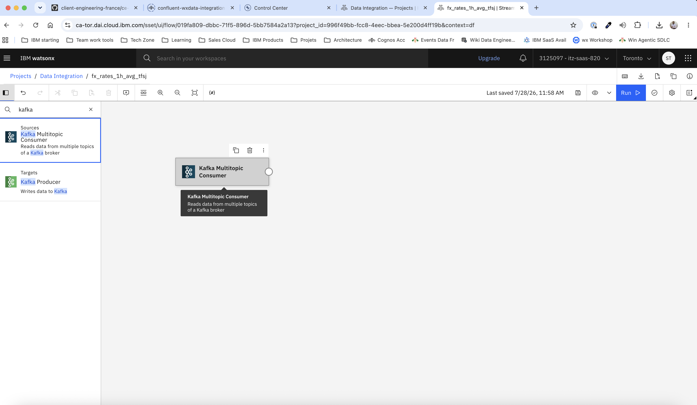

### 3b — Configure the Connection section

Click the **Kafka Multitopic Consumer** stage to open its configuration panel on the right.

Fill in the **Connection** section:

| Property | Value |
|----------|-------|
| **Broker URI** | *(bootstrap server from your connection sheet, e.g. `pkc-abc12.us-east-1.aws.confluent.cloud:9092`)* |
| **Consumer Group** | `streamsets-lab-<YOUR_INITIALS>` |
| **Topic List** | `fx_rates` |
| **Max Batch Size (records)** | *(leave default)* |
| **Batch Wait Time (ms)** | *(leave default)* |
| **Include timestamps** | ✅ checked |


### 3c — Configure the Security section

Expand the **Security** section. Set **Security option** to **`Custom authentication (security protocol=CUSTOM)`**.

This reveals a **Custom security properties** JSON editor. Click **Toggle bulk edit mode** and paste the following JSON array, substituting the two templated values from your connection sheet:

```json
[
  {
    "key": "security.protocol",
    "value": "SASL_SSL"
  },
  {
    "key": "sasl.mechanism",
    "value": "PLAIN"
  },
  {
    "key": "sasl.jaas.config",
    "value": "org.apache.kafka.common.security.plain.PlainLoginModule required username=\"<KAFKA_USERNAME>\" password=\"<KAFKA_PASSWORD>\";"
  },
  {
    "key": "ssl.endpoint.identification.algorithm",
    "value": "https"
  },
  {
    "key": "ssl.truststore.type",
    "value": "PEM"
  },
  {
    "key": "ssl.truststore.certificates",
    "value": "<KAFKA_CA_CERT_PEM>"
  }
]
```

| Placeholder | What to substitute |
|-------------|-------------------|
| `<KAFKA_USERNAME>` | Kafka username from your connection sheet |
| `<KAFKA_PASSWORD>` | Kafka password from your connection sheet |
| `<KAFKA_CA_CERT_PEM>` | Full PEM content of `kafka-ca.crt` — paste the entire `-----BEGIN CERTIFICATE-----` … `-----END CERTIFICATE-----` block as a single string (keep the literal newlines; StreamSets accepts multiline values in bulk edit mode) |

> **Why Custom authentication?** The Confluent cluster enforces mutual TLS with SASL/PLAIN on top. The Custom security properties block passes all required Kafka client properties directly, including the PEM-encoded CA certificate for server-side TLS verification.

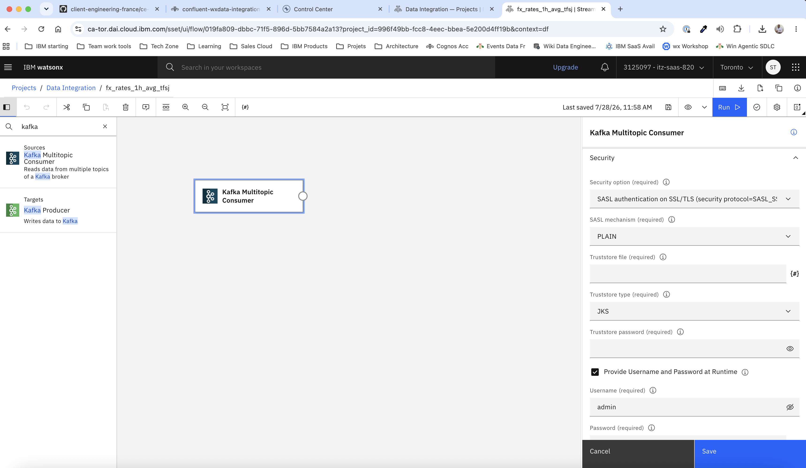

### 3d — Configure the Data Format section

Expand the **Data format** section:

| Property | Value |
|----------|-------|
| **Data Format** | `Avro` |
| **Avro schema location** | `Confluent schema registry` |
| **Schema registry URLs** | *(Schema Registry URL from your connection sheet, e.g. `https://163.66.85.93/sr`)* |
| **Schema registry security option** | `None (security protocol=PLAINTEXT)` |
| **Basic auth user info** | `<SR_USERNAME>:<SR_PASSWORD>` *(from your connection sheet)* |
| **Lookup schema by** | `Subject` |
| **Schema subject** | `fx_rates-value` |

> **Why `fx_rates-value`?** Schema Registry stores schemas under a **subject name** derived from the topic name. For a value schema on topic `fx_rates` the subject is always `fx_rates-value`.


---

Click the **Save** button to save the settings.

---

## Step 4 — Add the Expression Evaluator

The **Expression Evaluator** stage promotes the Kafka broker timestamp — surfaced as a record header attribute — into a `/timestamp` record field of type `DATETIME`. This gives every record a proper wall-clock timestamp that will be stored in the final Iceberg table.

> **Why this?** The timestamp is not part of the Avro payload; it arrives as a record header attribute (`timestamp`, in milliseconds epoch). The Expression Evaluator converts it into a proper `DATETIME` field using `${time:millisecondsToDateTime(record:attribute('timestamp'))}`.

### 4a — Add the stage

1. In the stage library, under **Processors**, search for **Expression Evaluator**.
2. Drag it onto the canvas, to the right of the Kafka Multitopic Consumer stage.

### 4b — Connect the stages

Hover over the **Kafka Multitopic Consumer** output port (right-side arrow). When the arrow turns orange, drag it to the **Expression Evaluator** input port.

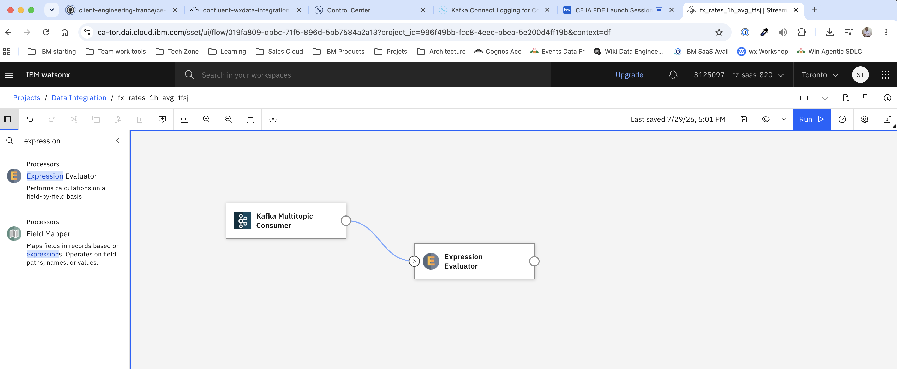

### 4c — Configure the Field expressions

Click the **Expression Evaluator** stage to open its configuration panel.

In the **Expressions** section, click **Toggle bulk edit mode** and paste the following JSON array:

```json
[
  {
    "fieldToSet": "/timestamp",
    "expression": "${time:millisecondsToDateTime(record:attribute('timestamp'))}"
  }
]
```

| Field | Meaning |
|-------|---------|
| `fieldToSet` | `/timestamp` — new record field that will be created (type `DATETIME`) |
| `expression` | `record:attribute('timestamp')` reads the Kafka broker timestamp (ms epoch) from the record header; `time:millisecondsToDateTime(…)` converts it to a `DATETIME` value |


---

Click the **Save** button to save the settings.

---

## Step 5 — Add the Stream Selector

The **Stream Selector** stage routes records into different output lanes based on a predicate expression. You will use it to keep only the EUR/USD records and discard the rest.

### 5a — Add the stage

1. In the stage library, under **Processors**, search for **Stream Selector**.
2. Drag it onto the canvas, to the right of the Expression Evaluator stage.
3. Connect the **Expression Evaluator** output to the **Stream Selector** input.

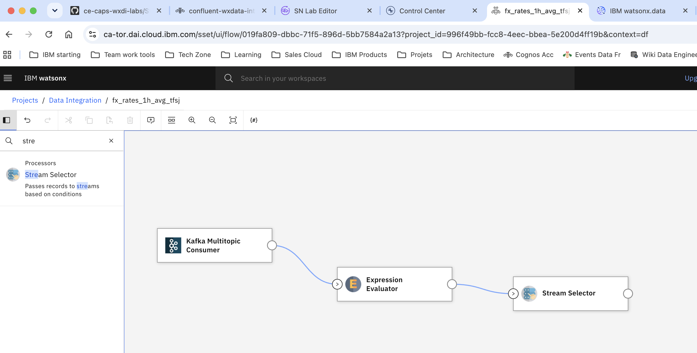

### 5b — Configure the Conditions

Click the **Stream Selector** stage to open its configuration panel. You will see a **Conditions** section with one pre-existing row (the default output lane).

Click **Add** to add a new condition row above the default, then fill it in:

| Lane | Predicate |
|------|-----------|
| **Output lane 1** (matched) | `${record:value('/from_currency') == 'EUR' && record:value('/to_currency') == 'USD'}` |
| **Output lane 2** (default) | *(leave blank — this catches all records that did not match lane 1)* |

> **How Stream Selector works:** Records are evaluated against the conditions **in order**. The first condition that evaluates to `true` routes the record to that output lane. Records that match no condition go to the **default** lane (always the last lane). In our case:
> - EUR/USD records → lane 1 → IBM watsonx.data
> - All other currency pairs → lane 2 (default) → Trash


---

Click the **Save** button to save the settings.

---

### 5c — Add the Trash stage for unmatched records

Records that do not match the EUR/USD filter must be routed somewhere — StreamSets requires every output lane to be connected. The **Trash** stage silently discards records.

1. In the stage library, under **Destinations**, search for **Trash**.
2. Drag it onto the canvas below and to the right of the Stream Selector.
3. Connect **Stream Selector output lane 2** (the default lane) to the **Trash** input.

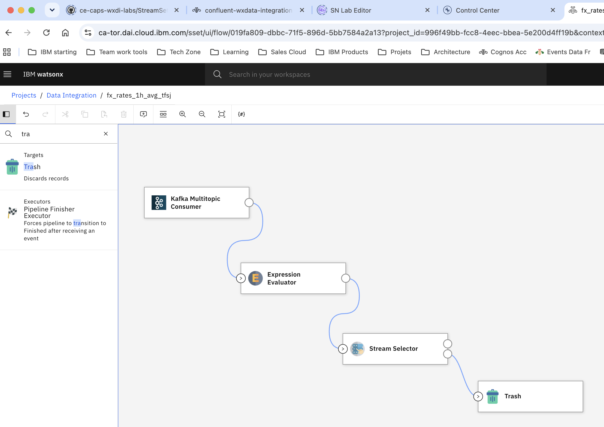

---

## Step 6 — Add the IBM watsonx.data Destination

The **IBM watsonx.data** target stage writes each filtered EUR/USD record to the `fx_eurusd_<YOUR_INITIALS>` table using the IBM Flight Service.

### 6a — Add the stage

1. In the stage library search box, type `wat`.
2. Under **Targets**, select **IBM watsonx.data** ("Writes data to IBM watsonx.data using Flight Service").
3. Drag it onto the canvas, to the right of the Stream Selector.
4. Connect **Stream Selector output lane 1** (the matched lane) to the **IBM watsonx.data** stage input.

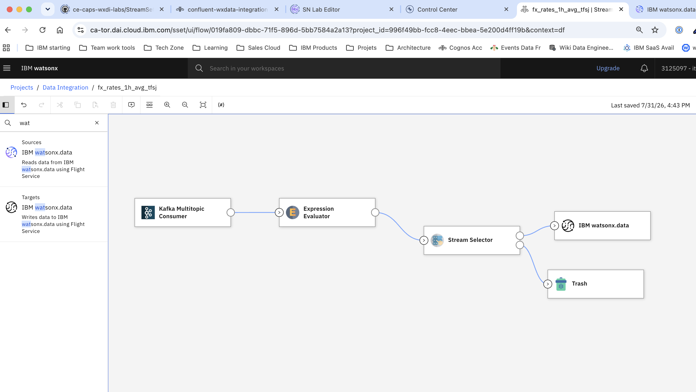

### 6b — Configure the engine connection

Click the **IBM watsonx.data** stage to open its configuration panel. Fill in the top section:

| Property | Value |
|----------|-------|
| **Host** | *(from your connection sheet)* |
| **Port** | *(from your connection sheet)* |
| **Deployment Type** | *IBM watsonx.data on IBM Cloud* |
| **CRN** | *(from your connection sheet)* |
| **Engine ID** | *(from your connection sheet)* |
| **Engine Host** | *(from your connection sheet)* |
| **Engine Port** | *(from your connection sheet)* |
| **Use SSL** | ✅ checked *(the Flight Service endpoint uses TLS)* |
| **SSL certificate** | *(from your connection sheet)* |

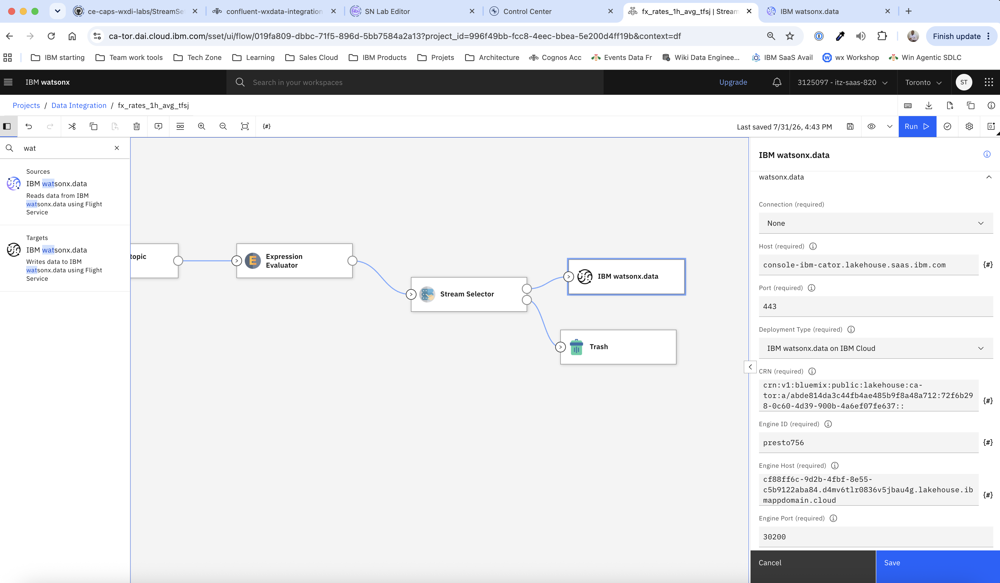

### 6c — Configure the Credentials section

Scroll down to the **Credentials** section and fill in:

| Property | Value |
|----------|-------|
| **API Key** | *(IBM Cloud API key from your connection sheet)* |

> **Where to get the API key:** Your tutor will provide an IBM Cloud API key that has access to the watsonx.data instance.

### 6d — Configure the Tables section

Scroll down to the **Tables** section and fill in:

| Property | Value |
|----------|-------|
| **Catalog name** | `iceberg` |
| **Schema name** | `fx_analytics` |
| **Table name** | `fx_eurusd_<YOUR_INITIALS>` |
| **Auto create table** | ✅ checked *(StreamSets will create the Iceberg table on first write if it does not exist)* |


---

Click the **Save** button to save the settings.

---

## Step 7 — Save and Validate the Pipeline

Before running the pipeline, save your work and use StreamSets' built-in validation to catch any configuration errors.

1. Click the **Save** button (disk icon) in the top toolbar of the canvas to persist all stage configuration.

2. Click the **Validate** button (checkmark icon) in the same toolbar.

3. Wait a few seconds. A green **"Validation Successful"** banner should appear.

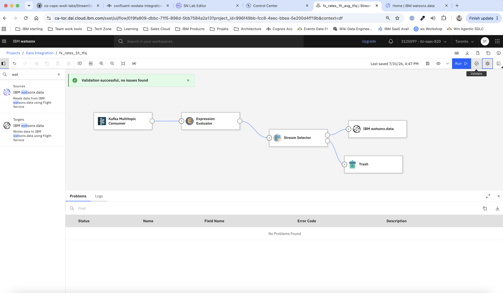

If you see red stage icons, click the stage and read the error message in the **Issues** tab at the bottom of the canvas. Common issues:

| Error message | Likely cause | Fix |
|---------------|-------------|-----|
| `Unable to connect to Kafka broker` | Wrong broker address or credentials | Re-check the Security section of the Kafka Multitopic Consumer |
| `Schema Registry unreachable` | Wrong Schema Registry URL | Re-check the Data Format section — Schema registry URLs field |
| `Connection refused` on IBM watsonx.data | Wrong Engine Host, Engine Port, or Engine ID | Re-check the engine connection fields of the IBM watsonx.data stage |
| `Authentication failed` on IBM watsonx.data | Invalid API key | Re-check the Credentials → API Key field |
| `Field /rate not found` | Field name mapping issue | Ensure the Avro schema includes a `rate` field (re-check Step 3d) |
| `DATA_FORMAT_06` — `SSLHandshakeException: certificate_expired` / `PKIX path validation failed` | The VSI's TLS certificate for the Schema Registry (`registry_url`) has expired or is no longer trusted by the default Java truststore | Build a custom JKS truststore containing both the VSI certificate and the Kafka CA certificate, mount it into the StreamSets container, and update the Kafka Multitopic Consumer Data Format settings — see **[Expired Schema Registry certificate](#expired-schema-registry-certificate)** below |

---

### Expired Schema Registry certificate

The error below means the StreamSets engine cannot validate the TLS certificate presented by the Schema Registry:

```
DATA_FORMAT_06 — Cannot create the parser factory:
  SchemaRegistryException: javax.net.ssl.SSLHandshakeException:
  (certificate_expired) PKIX path validation failed:
  java.security.cert.CertPathValidatorException: validity check failed
```

You need to build a custom JKS truststore that contains the VSI's certificate and the Kafka CA certificate, upload it to the VSI, restart the engine with the truststore volume mounted, and point the pipeline at it.

**Step A — Download the VSI certificate from your browser**

1. Open your `https` registry url in Chrome (eg: https://163.66.85.93/sr).
2. Click the **Not Secure** padlock → **Certificate details** → navigate to the certificate details panel.
3. Export / download the leaf certificate as a PEM file (e.g. `vsi-cert.pem`).


**Step B — Download the Kafka CA certificate from the VSI**

The kafka CA certificate should already have been shared with you.

**Step C — Build the JKS truststore**

Import both certificates into a new JKS keystore named `kafka.ts` (password `changeit`):

```bash
# Import the Kafka CA certificate
keytool -import -trustcacerts -noprompt -alias kafka-ca \
  -file ./kafka-ca.crt -keystore ./kafka.ts -storepass changeit

# Import the VSI certificate (Schema Registry TLS leaf cert)
keytool -import -trustcacerts -noprompt -alias vsi-ca \
  -file ./vsi-cert.pem -keystore ./kafka.ts -storepass changeit
```

**Step D — Upload the truststore to the VSI**

```bash
scp -i id_rsa.pub ./kafka.ts root@###vsi_ip###:/var/lib/confluent-access/
```

**Step E — Restart the StreamSets engine with the volume mounted**

SSH into the VSI, stop any running container, then start a new one with the `/var/lib/confluent-access/` folder mounted to `/confluent` inside the container (option `-v /var/lib/confluent-access:/confluent` added to the docker run command)

Eg:

```bash
ssh -i id_rsa.pub root@163.66.85.93

# Stop the currently running StreamSets container
docker ps                        # note the container ID
docker stop <container_id>

# Start a new container with the truststore volume mounted
export SSET_API_KEY=<your_api_key>

docker run \
  -d \
  --cpus 4.0 \
  -v /var/lib/confluent-access:/confluent \
  -e SSET_PROJECT_ID=996f49bb-fcc8-4eec-bbea-5e200d4ff19b \
  -e SSET_ENVIRONMENT_ID=019f947e-abd3-73d9-8a03-a05f2e1fa7a9 \
  -e SSET_BASE_URL=https://api.ca-tor.dai.cloud.ibm.com \
  -e SSET_API_KEY="${SSET_API_KEY:?Please provide your API key from IBM Cloud}" \
  icr.io/streamsets/datacollector:JDK17_7.6.1
```

The truststore file is now available inside the container at `/confluent/kafka.ts`.

**Step F — Update the Kafka Multitopic Consumer Data Format settings**

In the StreamSets pipeline editor, click the **Kafka Multitopic Consumer** stage, open the **Data Format** tab, and update the **Schema registry security option** section as follows:

| Property | Value |
|----------|-------|
| **Schema registry security option** | `SSL/TLS encryption (security protocol=SSL)` |
| **Truststore type** | `JKS` |
| **Truststore file** | `/confluent/kafka.ts` |
| **Truststore password** | `changeit` |


Click **Save**, then click **Validate** again. The `DATA_FORMAT_06` error should no longer appear and the banner should read **"Validation successful, no issues found."**

---

## Step 8 — Preview the Pipeline (Data Preview)

StreamSets' **Preview** mode connects to Kafka, reads a small batch of records, and shows you the data at each stage — without writing anything to Presto. This lets you confirm the field shapes and routing logic before committing to a full run.

1. In the canvas toolbar, click the **Preview** button (play icon with an eye symbol), then **Configure preview**.

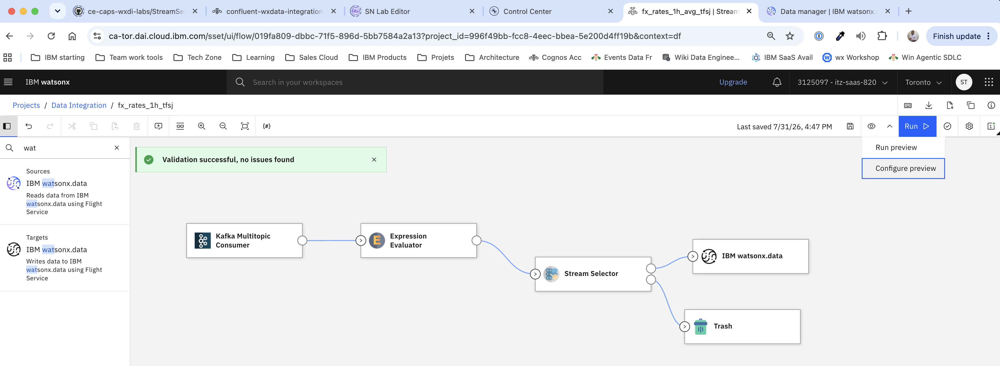

2. The **Preview Configuration** dialog opens. Set **Preview batch size** to `10` and click **Run Preview**.

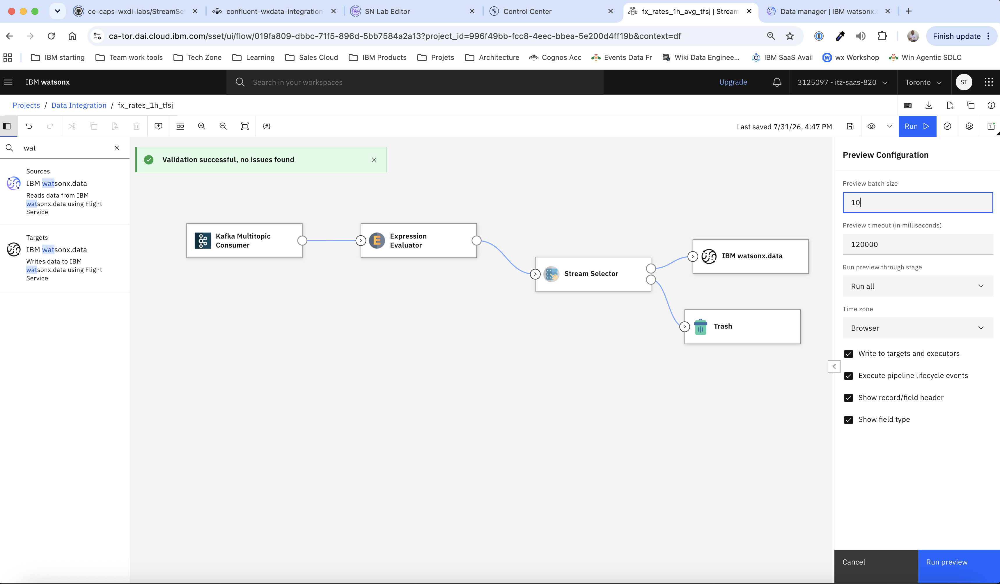

3. The canvas switches to preview mode. The **Kafka Multitopic Consumer** stage is automatically selected, showing the records it read from the `fx_rates` topic.

4. Click the **Expression Evaluator** stage in the canvas to see the data after the timestamp conversion:


5. Click the **Stream Selector** stage to see the routing in action:


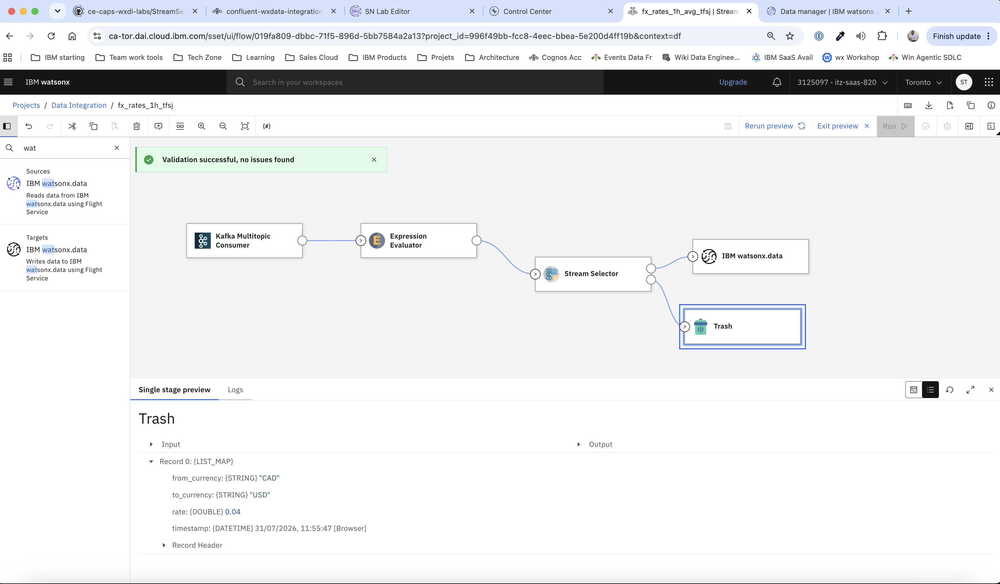

6. Click **Close Preview** to return to the canvas.

---

## Step 9 — Start the Pipeline

1. Click **Run** (the green triangle play button) in the canvas toolbar.

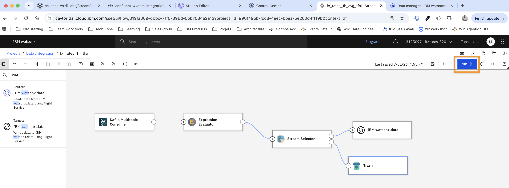

2. A confirmation dialog may appear — click **Start** to confirm.

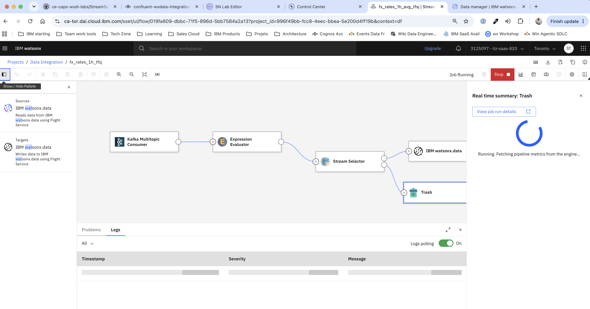

3. After 10–15 seconds the pipeline transitions to the **RUNNING** state. All stage boxes turn green.

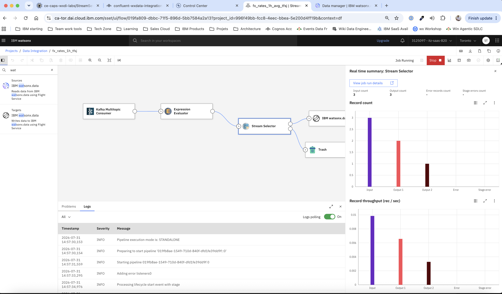

4. You should immediately see the **Kafka Multitopic Consumer** stage incrementing its record count as it reads messages. EUR/USD records will start appearing at the **IBM watsonx.data** destination.

---

### 10 — Verify data in watsonx.data

After a few minutes you can query the target table directly from the IBM Data Fabric platform.

1. Navigate to the watsonx.data instance your tutor shared.
2. Open the **Data Manager** workspace and unfold the `iceberg` catalog.
3. Unfold the `fx_analytics` schema, select your table `fx_eurusd_<YOUR_INITIALS>`, then select the `Data sample` tab:

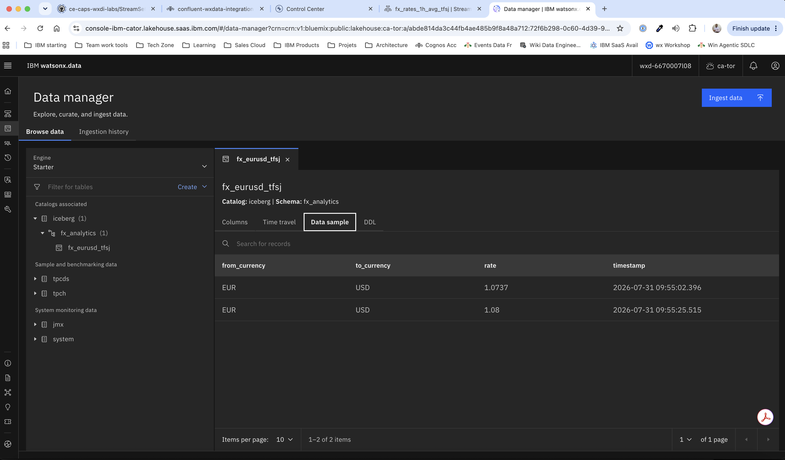

4. You can also try this query in the **Query Workspace**:

```sql
SELECT *
FROM "fx_analytics"."fx_eurusd_<YOUR_INITIALS>"
ORDER BY timestamp DESC
LIMIT 10;
```

> **Tip:** In the watsonx.data SQL editor the catalog prefix is selected from the catalog/schema dropdowns rather than typed inline. Select catalog `iceberg`, schema `fx_analytics`, then run the query without the catalog prefix, or use the three-part name shown above.


---

## Summary

You have just built a fully operational, real-time streaming pipeline using IBM watsonx.data Integration (StreamSets):

| Stage | Role |
|-------|------|
| **Kafka Multitopic Consumer** | Reads Avro messages from the `fx_rates` topic via Schema Registry (~2 messages/min); includes broker timestamp as a header attribute |
| **Expression Evaluator** | Promotes the broker timestamp header attribute to a `/timestamp` record field of type `DATETIME` using `time:millisecondsToDateTime` |
| **Stream Selector** | Routes EUR/USD records (lane 1) to watsonx.data; all other currency pairs (lane 2, default) to Trash |
| **IBM watsonx.data** | Writes matched EUR/USD rows to `fx_analytics.fx_eurusd_<YOUR_INITIALS>` via the IBM Flight Service |
| **Trash** | Silently discards non-EUR/USD records (required — every output lane must be connected) |

The pipeline is now running autonomously. Every time a new EUR/USD tick arrives it is written directly to the lakehouse table. Isabelle's treasury desk now has a continuously updated, governed, queryable table — with no manual spreadsheet exports required.

---

## What's Next

Proceed to **[Module 2](../module2/MODULE2.md)** — you will import this watsonx.data table into an IBM Data Integration project and build the EUR/USD rate line chart visualisation.

---

<div align="center">
<sub>IBM watsonx.data Integration Lab &nbsp;·&nbsp; Real-Time FX Rate Analytics &nbsp;·&nbsp; EUR/USD</sub>
<br/><br/>
<sub>Guide maintained by the IBM France Client Engineering team</sub>
</div>
