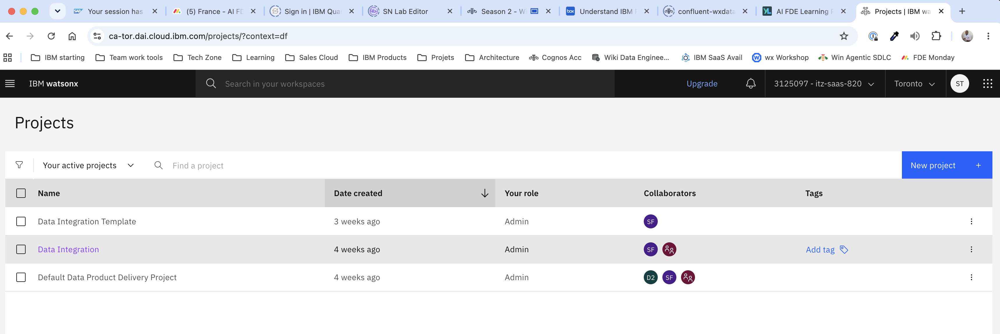
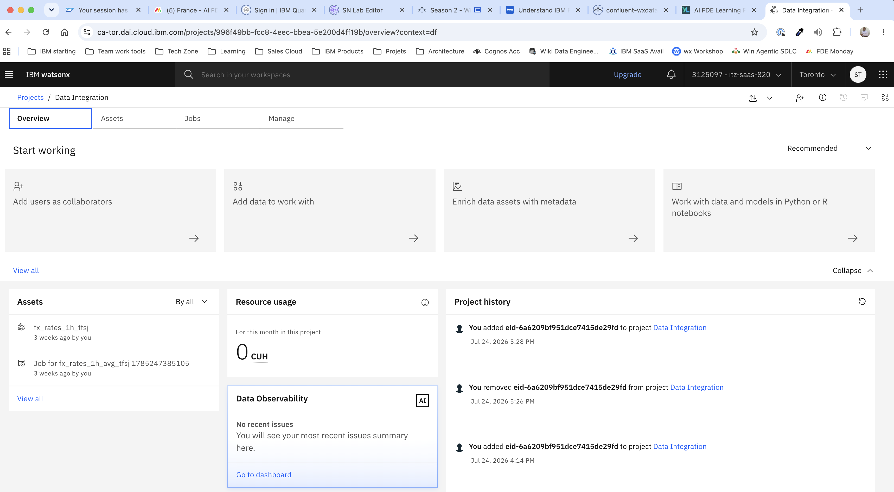
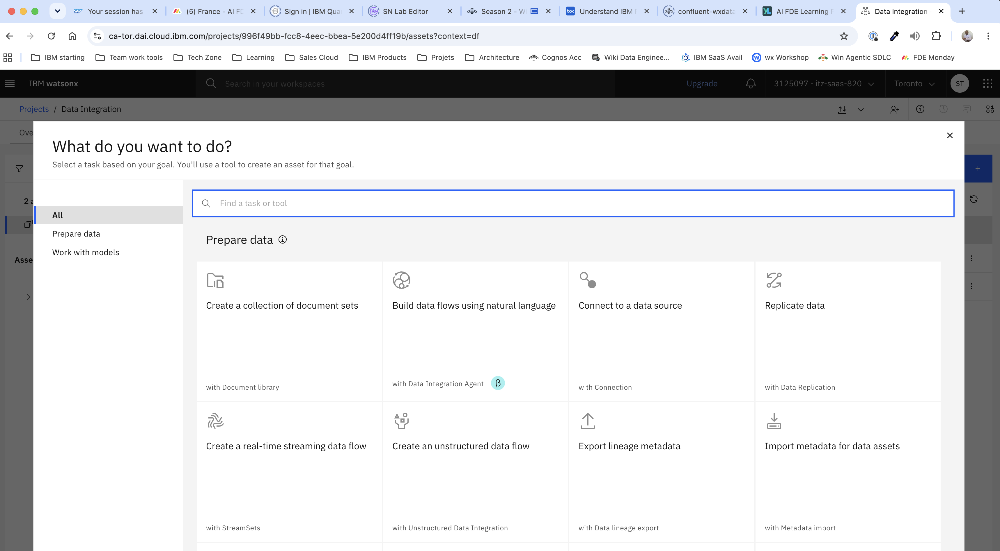
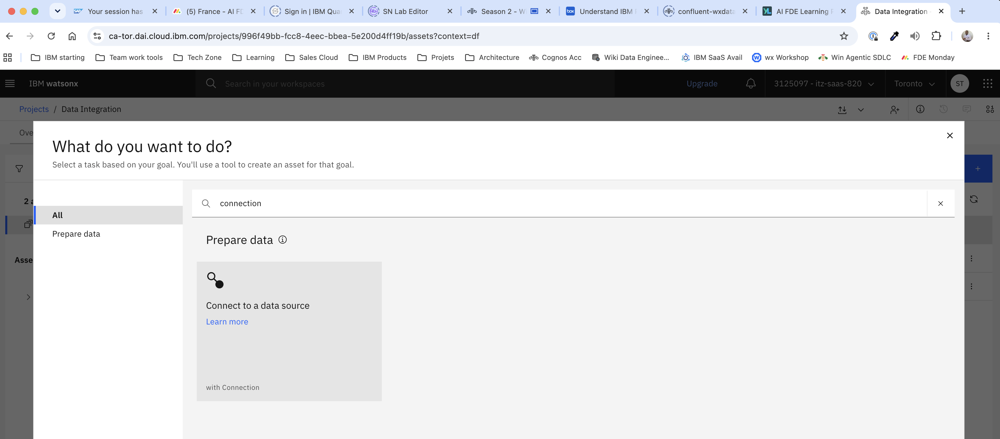
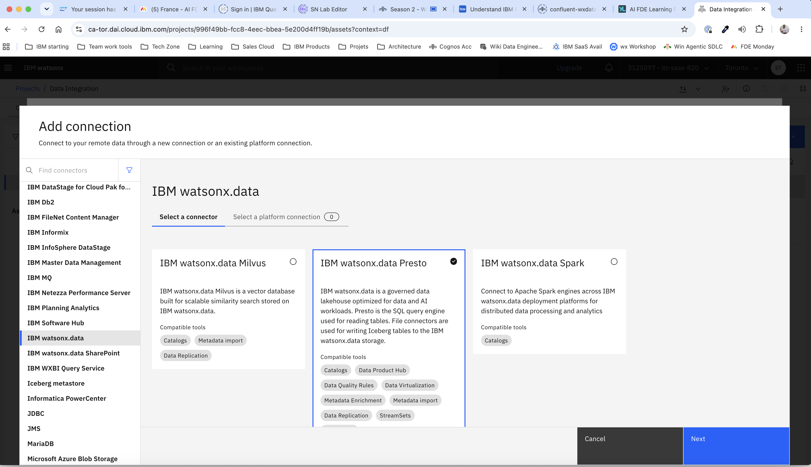
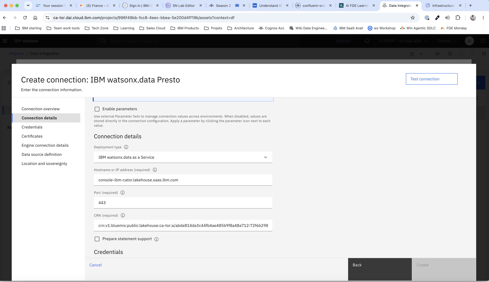
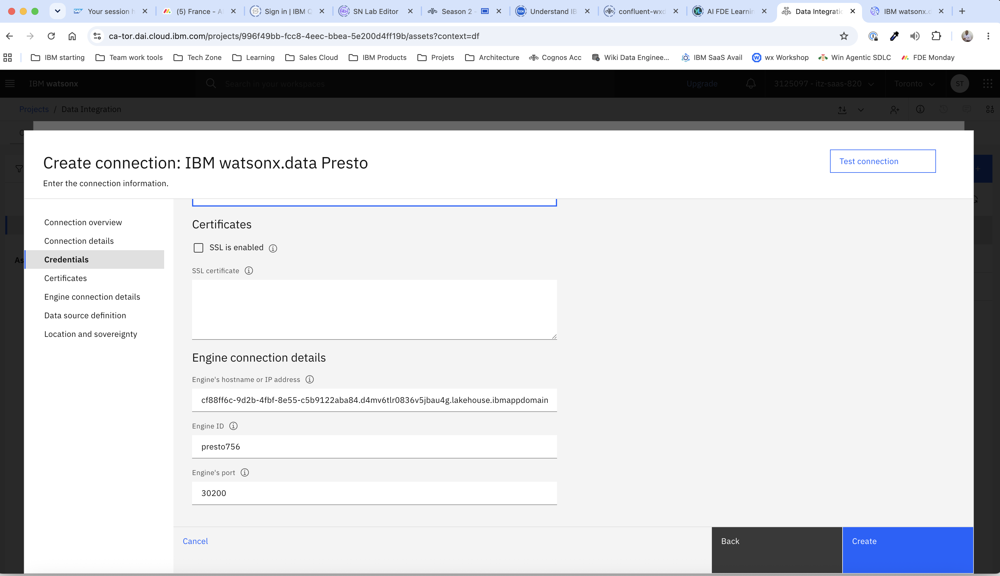
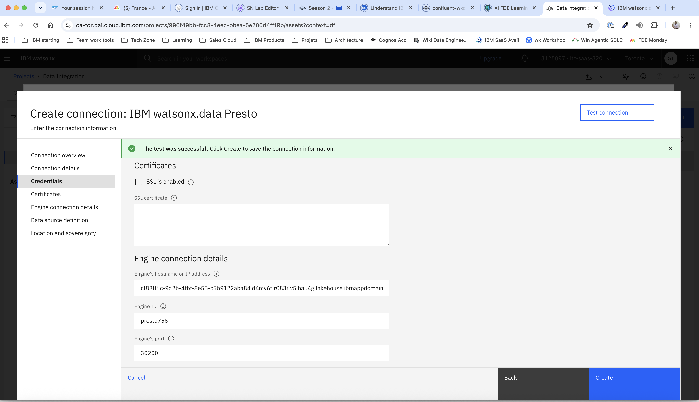
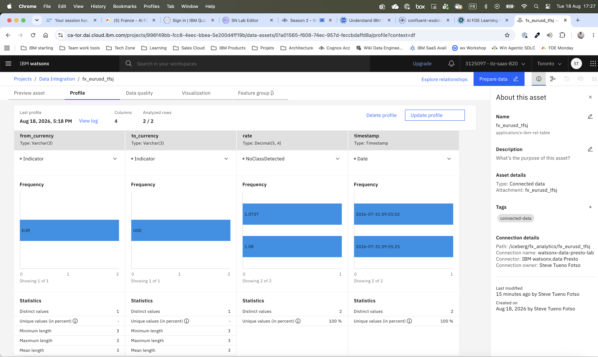

# Module 2 — Import the Table & Visualise in IBM Data Integration

> **Audience:** Lab participant  
> **Duration:** ~45 minutes  
> **Prerequisites:** Module 1 is complete and the StreamSets pipeline is in **RUNNING** state with at least **one row** in the `iceberg.fx_analytics.fx_eurusd_<YOUR_INITIALS>` table.

---

## Overview

In this module you will:

1. Connect IBM Data Integration (`ca-tor.dai.cloud.ibm.com`) to the watsonx.data Presto endpoint as a **data connection**
2. Import the `fx_eurusd_<YOUR_INITIALS>` table as a **data asset** into an IBM Data Integration project
3. Build a **line chart** visualising the EUR/USD exchange rate over time — the chart that Isabelle's treasury desk will use every day

At the end you will have a governed, shareable visualisation that auto-refreshes every time a new EUR/USD tick lands in the table.

---

## Before You Start

You need the following from your tutor's connection details sheet:

| Item | Used for |
|------|---------|
| watsonx.data Hostname or IP address | IBM watsonx.data Presto connection — hostname |
| watsonx.data Port | IBM watsonx.data Presto connection — port |
| watsonx.data Instance ID | IBM watsonx.data Presto connection — instance ID |
| watsonx.data Instance name | IBM watsonx.data Presto connection — instance name |
| watsonx.data CRN | IBM watsonx.data Presto connection — CRN |
| IBM Cloud API key | Your IBM Cloud API key |
| SSL certificate | IBM watsonx.data Presto connection — certificates |
| watsonx.data Engine Host | IBM watsonx.data Presto connection — engine hostname |
| watsonx.data Engine ID | IBM watsonx.data Presto connection — engine ID |
| watsonx.data Engine Port | IBM watsonx.data Presto connection — engine port (default 8443) |
| IBM DAI project name | The project you will work in (eg: `Data Integration`) |

You also need:
- At least **one row** in `iceberg.fx_analytics.fx_eurusd_<YOUR_INITIALS>` (the pipeline only writes EUR/USD records — check with your tutor if the table is still empty after a few minutes)
- Your IBM ID logged in to `https://ca-tor.dai.cloud.ibm.com`

---

## Step 1 — Log in to IBM Data Integration

1. Open a new browser tab and navigate to **[https://ca-tor.dai.cloud.ibm.com](https://ca-tor.dai.cloud.ibm.com)**.
2. Click **Log in with IBM ID** and enter your credentials.
3. After login you will land on the IBM Data Integration home page.


---

## Step 2 — Open Your Project

1. In the left sidebar, click **Projects**.
2. Find the project  (eg: **Data Integration**) created by your tutor in the setup guide and click on it.



3. You are now on the **project overview page**.



---

## Step 3 — Create a Presto Connection

Before importing a table, you must register the watsonx.data Presto endpoint as a **connection** inside the project. This connection is reusable — any asset in the project can use it.

### 3a — Navigate to the Assets tab

1. Click the **Assets** tab on the project page.
2. Click **+ New asset** (top-right corner of the assets panel).



### 3b — Choose Connection type

In the **New asset** dialog:

1. Search for **Connection** in the asset type search box.
2. Select **Connection** from the results.



### 3c — Select the IBM watsonx.data Presto connector

In the **Add connection** panel:

1. In the left sidebar, click the **IBM watsonx.data** filter category (or search for `prest` in the search box at the top).
2. Select the **IBM watsonx.data Presto** tile.
3. Click **Next**.



### 3d — Fill in connection details

The **IBM watsonx.data Presto** connector form is divided into sections. Fill in each section as follows.

**Connection overview**

| Field | Value |
|-------|-------|
| **Connection name** | `watsonx-data-presto-lab` |
| **Description** | `watsonx.data Presto connection for the FX rate lab` |


**Connection details**

| Field | Value |
|-------|-------|
| **Deployment type** | `IBM watsonx.data as a Service` |
| **Hostname or IP address** | *(from your connection sheet)* |
| **Port** | *(from your connection sheet)* |
| **Instance ID** | *(from your connection sheet)* |
| **Instance name** | *(from your connection sheet)* |
| **CRN** | *(from your connection sheet)* |



**Credentials**

| Field | Value |
|-------|-------|
| **API key** | *(IBM Cloud API key from your connection sheet)* |

**Certificates**

| Field | Value |
|-------|-------|
| **SSL is enabled** | ✅ checked *(pre-ticked — leave enabled)* |
| **SSL certificate** | *(leave empty or paste the SSL certificate from your connection sheet)* |

**Engine connection details**

| Field | Value |
|-------|-------|
| **Engine's hostname or IP address** | *(watsonx.data Engine Host from your connection sheet)* |
| **Engine ID** | *(watsonx.data Engine ID from your connection sheet)* |
| **Engine's port** | *(watsonx.data Engine Port from your connection sheet)* |



### 3e — Test and create the connection

1. Click **Test connection** at the bottom of the form.
2. Wait for the **green "Connection successful"** confirmation.



> If you see **"Connection failed"**, verify the Hostname, Port, CRN, credentials, and SSL certificate with your tutor. Ensure the **SSL is enabled** checkbox remains checked — the IBM watsonx.data Presto endpoint always requires TLS.

3. Click **Create** to save the connection.


---

## Step 4 — Import the `fx_eurusd_<YOUR_INITIALS>` Table as a Data Asset

Now that the connection exists you will import the specific table as a **connected data asset** — a live reference to the Presto table that updates automatically every time a new EUR/USD tick is written by StreamSets.

### 4a — Open the Import assets dialog

1. On the **Assets** tab, locate the top-right toolbar. Click the **Import assets** text link (just to the left of the blue **New asset +** button).

The **Import assets** dialog opens. The left sidebar shows the source types available: **Connected data**, Catalog asset, Samples, Local file, Project files.

### 4b — Navigate to the table

1. In the left sidebar, select **Connected data**.
2. The first column lists available connections in the project — click **`watsonx-data-presto-lab`**.
3. The second column shows the Presto catalogs — click **`iceberg`**.
4. The third column shows the schemas — click **`fx_analytics`**.
5. The fourth column shows the tables — tick the checkbox next to **`fx_eurusd_<YOUR_INITIALS>`**.


### 4c — Confirm the selection and import

A **Selected assets** panel appears on the right confirming:

- **Name:** `fx_eurusd_<YOUR_INITIALS>`
- **Type:** Table
- **Path:** `/iceberg/fx_analytics/fx_eurusd_<YOUR_INITIALS>`
- **Fields (4):** `from_currency` (varchar), `to_currency` (varchar), `rate` (double), `timestamp` (timestamp)
- **Connection name:** `watsonx-data-presto-lab`


Click **Import**.


---

## Step 5 — Preview the Data Asset

Before building the visualisation, confirm the data looks correct.

Click on the **`fx_eurusd_<YOUR_INITIALS>`** asset in the assets list to open its detail page.


> If the table is empty, check that the StreamSets pipeline has been running for a few minutes. Because the Datagen connector generates data for 10 × 10 = 100 currency pairs, EUR/USD is approximately 1 in 100 records — so allow at least 2–3 minutes before the first row appears. Ask your tutor to confirm the `fx_eurusd_<YOUR_INITIALS>` table has data in the Presto console.




---

## Step 6 — Visualise the Data Asset

IBM Data Integration includes a built-in **Visualization** tab on every data asset. You will use it to build a line chart of the EUR/USD exchange rate directly from the `fx_eurusd_<YOUR_INITIALS>` asset.

### 6a — Open the Visualization tab

1. In the project **Assets** tab, click on the **`fx_eurusd_<YOUR_INITIALS>`** asset to open its detail page.
   The asset detail page opens with **Preview asset** selected by default.
2. In the tab bar — **Preview asset** | **Profile** | **Data quality** | **Visualization** | **Feature group β** — click **Visualization**.
   It is the fourth tab, immediately to the right of **Data quality**.

![*The `fx_eurusd_<YOUR_INITIALS>` data asset detail page with the Visualization tab selected. A chart-type banner at the top shows: Scatter plot, Line, Multi-series, Histogram, Population, Q-Q plot, Pie, Bar, Relationship. The main area shows a prompt: "Choose a chart from the chart type banner or select the columns that you want to visualize, and then choose a chart." A "Columns to visualize" dropdown and an "Add another column +" link are visible. The right panel shows asset metadata including Connection details with path `/iceberg/fx_analytics/fx_eurusd_<YOUR_INITIALS>`.*](../images/screenshots/m2-15-visualization-tab.png)

### 6b — Select the columns to visualise

1. Click the **Columns to visualize** dropdown and select **`timestamp`**.
2. Click **+ Add another column** and select **`rate`**.


### 6c — Choose the Line chart type

In the **CHART TYPE** banner at the top, click **Line**.


Your finished line chart shows the EUR/USD exchange rate over time, rendered directly from the live Presto table.


### What Isabelle now has

| Before | After |
|--------|-------|
| Manual export from Reuters terminal | Automatic — pipeline runs 24/7 |
| Excel formula to filter and format rates | StreamSets Stream Selector |
| Email PNG to colleagues | Shared IBM DAI asset with built-in visualisation |
| 2-hour turnaround for ad-hoc queries | Sub-second SQL query on Presto |
| No governance metadata | IBM DAI asset with description, lineage, quality metrics, and profile |

---

## Step 8 — Explore Further (Optional)

If you have time, try these extensions:

### 8a — Try other chart types

On the same **Visualization** tab, click a different chart type in the banner (e.g. **Scatter plot** or **Bar**). Compare how each representation highlights different aspects of the rate data.

### 8b — Query the table via SQL

Open the **SQL editor** (ask your tutor how to):

```sql
-- Hourly average and tick count — rolling up the raw ticks
SELECT
    DATE_TRUNC('hour', timestamp)   AS trading_hour,
    AVG(rate)                       AS hourly_avg_rate,
    MIN(rate)                       AS hourly_low,
    MAX(rate)                       AS hourly_high,
    COUNT(*)                        AS tick_count
FROM iceberg.fx_analytics.fx_eurusd_<YOUR_INITIALS>
GROUP BY DATE_TRUNC('hour', timestamp)
ORDER BY trading_hour DESC;
```

---

## Summary

You have completed the full end-to-end pipeline:

```
Datagen Connector (Confluent)
      │  (1 reading / 30 sec, 100 currency pairs)
      ▼
Confluent Kafka topic: fx_rates
      │  (Avro, Schema Registry)
      ▼
StreamSets Pipeline: fx_eurusd_filter_<YOUR_INITIALS>
      │  (Kafka → Expression Evaluator → Stream Selector → IBM watsonx.data)
      │  (unmatched pairs → Trash)
      ▼
watsonx.data Presto: iceberg.fx_analytics.fx_eurusd_<YOUR_INITIALS>
      │  (EUR/USD ticks only, continuously updated)
      ▼
IBM Data Integration: fx_eurusd_<YOUR_INITIALS> asset (Visualization tab)
      │  (governed, profiled, chart on live data)
      ▼
Isabelle's treasury desk ✓
```

**Key skills you have practised:**

| Skill | Tool used |
|-------|-----------|
| Streaming data ingest to Kafka | Confluent Datagen Connector |
| Schema-enforced message production | Confluent Schema Registry + Avro |
| No-code streaming pipeline construction | StreamSets DataOps |
| Record-level filtering on streaming data | StreamSets Stream Selector stage |
| Writing a streaming pipeline result to a lakehouse | StreamSets IBM watsonx.data destination → Presto |
| Data governance — asset registration and metadata | IBM Data Integration project |
| Business intelligence visualisation on live data | IBM Data Integration built-in Visualization tab |

---

## Lab Complete 🎉

Congratulations — you have reached the end of the **Real-Time FX Rate Analytics with StreamSets & IBM watsonx.data Integration** lab.

Please take a moment to let your tutor know you have finished. If you encountered any issues or have feedback on the lab content, share it with the IBM team — your input directly improves future sessions.

---

<div align="center">
<sub>IBM watsonx.data Integration Lab &nbsp;·&nbsp; Real-Time FX Rate Analytics &nbsp;·&nbsp; EUR/USD</sub>
<br/><br/>
<sub>Guide maintained by the IBM France Client Engineering team</sub>
</div>
