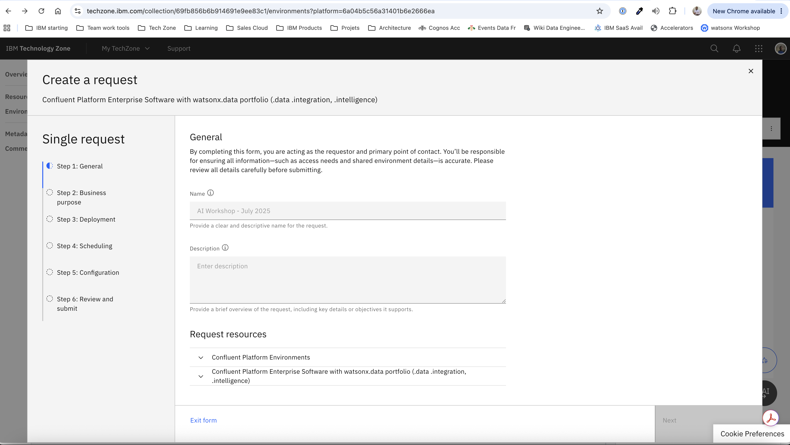
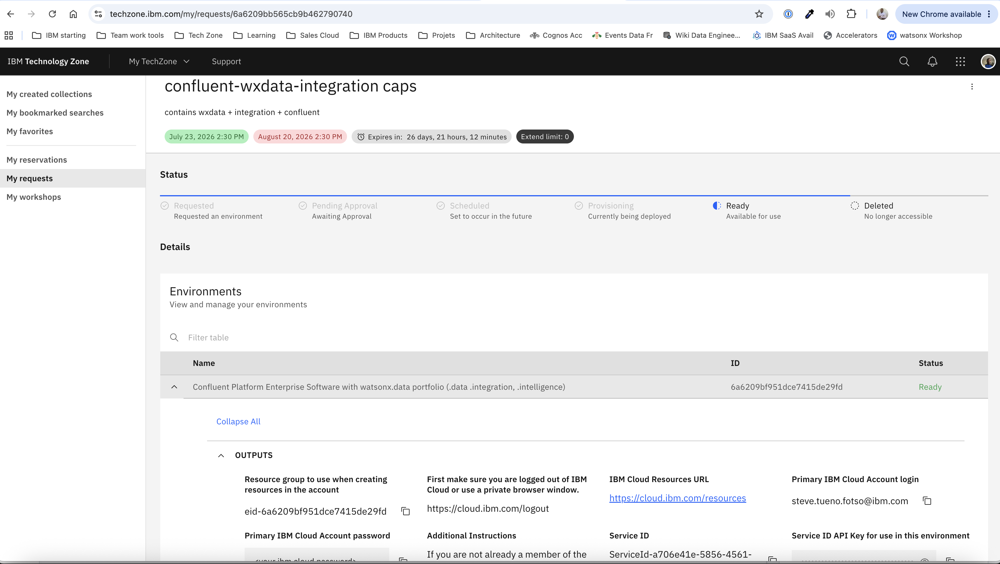
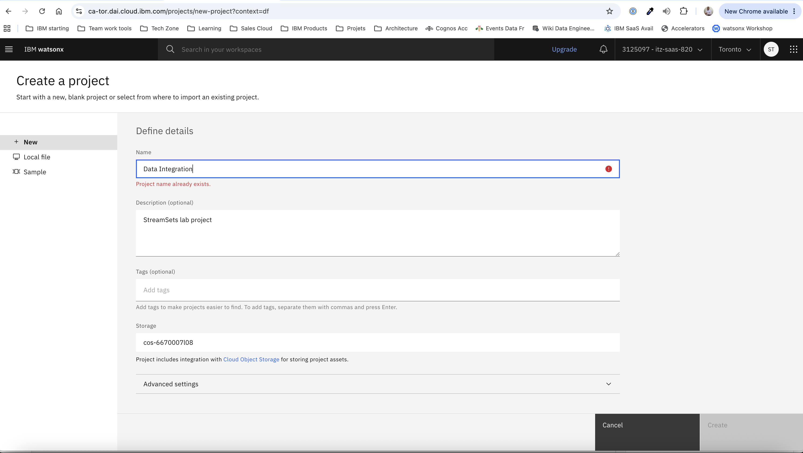
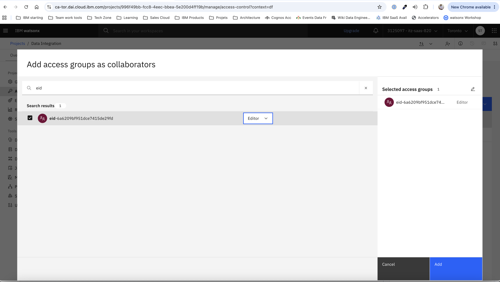
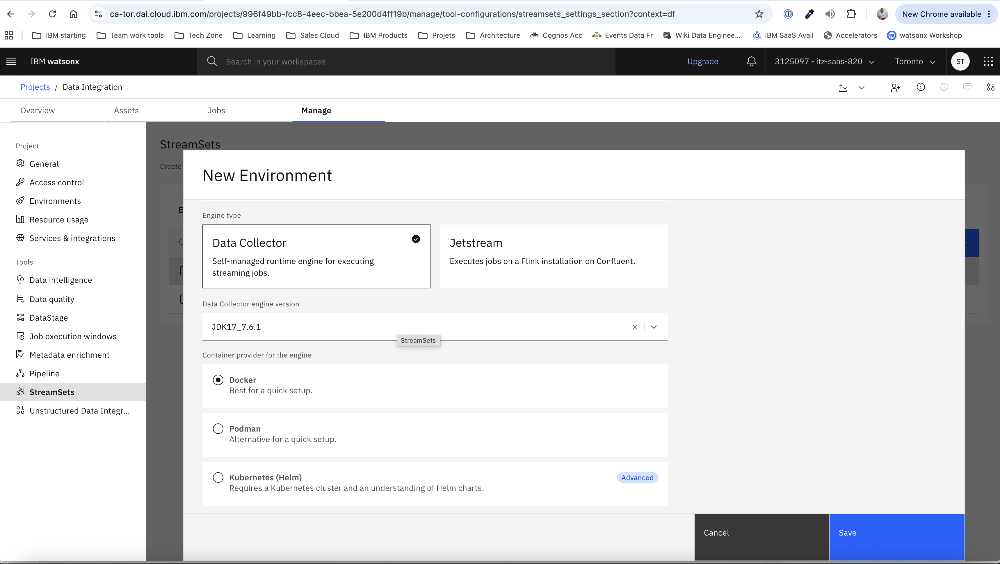
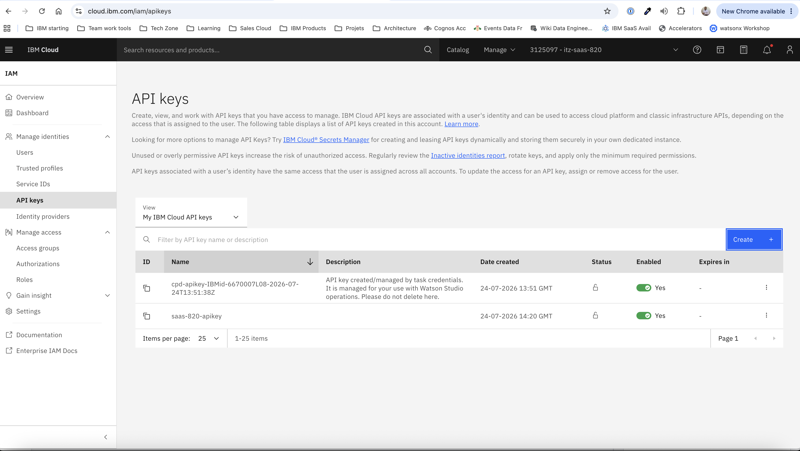
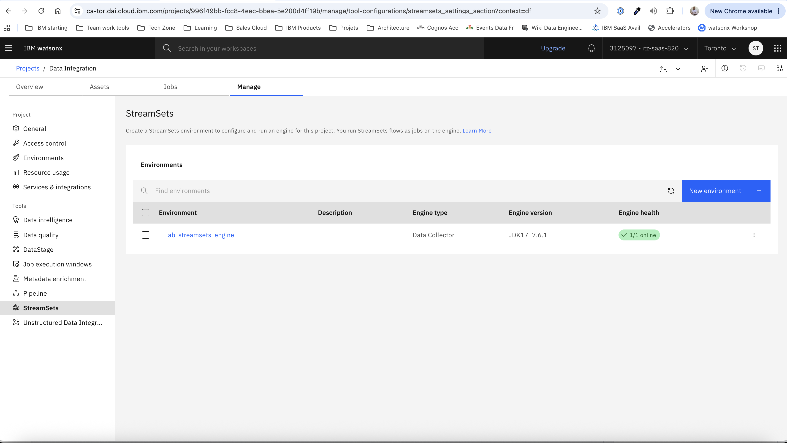
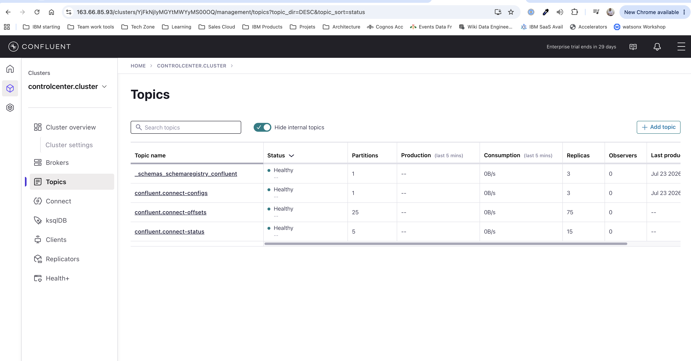
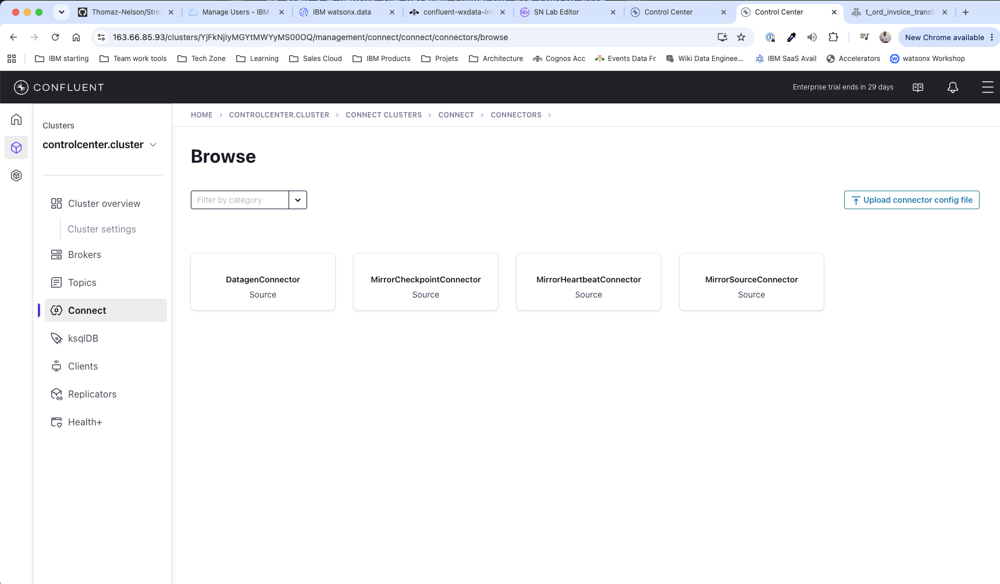

# Tutor Setup Guide — Environment Provisioning & Confluent Cluster Configuration

> **Audience:** Lab tutor / instructor only
> **Goal:** By the end of this guide you will have (1) a running TechZone environment with Confluent + watsonx.data + watsonx.data Integration/Intelligence, (2) a configured watsonx.data Integration project with student access and a StreamSets environment, and (3) the Confluent cluster producing synthetic EUR/USD rate data into the `fx_rates` topic.
> **Estimated time:** 60–90 minutes (includes TechZone provisioning wait time)

---

## Part 0 — TechZone Environment Reservation

### 0.1 — Reserve the environment

1. Open the [TechZone environment reservation page](https://techzone.ibm.com/collection/69fb856b6b914691e9ee83c1/environments?platform=6a74b63b374bd3b283e71305).
2. Complete the wizard:

   | Step | Field | Guidance |
   |------|-------|----------|
   | 1 — General | **Name** | Use a descriptive name, e.g. `StreamSets Lab — <date>` |
   | 1 — General | **Description** | Brief note on the lab session |
   | 2 — Business purpose | Purpose | Select the appropriate purpose for your engagement |
   | 2 — Business purpose | Opportunity | Enter the opportunity number if available |
   | 3 — Deployment | Geography | Select the region closest to your participants |
   | 4 — Scheduling | Start / End | Allow at least **30 minutes before the lab** for provisioning |
   | 5 — Configuration | (defaults) | Accept defaults |
   | 6 — Review | — | Verify dates, click **Submit** |



5. After submission TechZone sends a confirmation email. Provisioning typically completes within **20–40 minutes**. You can track progress at **My TechZone → My requests**.

### 0.2 — Collect environment outputs

Once the reservation status is **Ready**, expand the environment row and note the **Outputs** section. You will need these values throughout the setup:

| Output field | Where used |
|---|---|
| **Resource group** (e.g. `eid-6a6209bf951dce7415de29fd`) | Access group name prefix for the project |
| **IBM Cloud Resources URL** | Quick link to cloud resources |
| **Service ID API Key** | `SSET_API_KEY` for StreamSets engine |
| **Post-deployment text output** | Confluent and VSI access information (including SSH key + floating IP, see §0.3) |

*

### 0.3 — Save the VSI SSH private key

The TechZone **Post-deployment text output** section contains:

1. A PEM-formatted **SSH private key** for the Confluent VSI.
2. The VSI **floating IP** (public address).
3. SSH login command.

**To save and use the key:**

```bash
# 1. Copy the full PEM block from the TechZone output and save it
#    (include the -----BEGIN / -----END lines)
vim cflt-vsi-key.pem          # paste, then :wq

# 2. Restrict permissions — SSH refuses world-readable private keys
chmod 600 cflt-vsi-key.pem

# 3. Connect to the VSI (replace <FLOATING_IP> with the value from TechZone)
ssh -i cflt-vsi-key.pem root@<FLOATING_IP>
```

**Why the VSI?** It's the entry point to access and configure confluent services.  Docker is also pre-installed on the VM, so the StreamSets Data Collector engine container can run there, connecting back to the watsonx.data Integration control plane over the internet.

### 0.4 — Retrieve and distribute the Kafka CA certificate

The Confluent cluster uses TLS. Participants must supply the cluster's CA certificate when configuring the Kafka Consumer stage in StreamSets. The certificate is stored on the VSI at `/var/lib/confluent-access/kafka-ca.crt`.

**Copy it to your local machine** (run this on your laptop, not inside the VSI):

```bash
scp -i cflt-vsi-key.pem root@<FLOATING_IP>:/var/lib/confluent-access/kafka-ca.crt ./kafka-ca.crt
```

Replace `<FLOATING_IP>` with the VSI floating IP from the TechZone outputs (§0.2).

**Verify the file was copied:**

```bash
# Should print the certificate subject and issuer lines
openssl x509 -in kafka-ca.crt -noout -subject -issuer
```

**Distribute the certificate to participants** before the lab session. Options:

| Method | Notes |
|--------|-------|
| Shared file link (Box / OneDrive) | Easiest for remote sessions — include the link in the connection details handout |
| Printed/pasted PEM block | Participants paste it into StreamSets' TrustStore field directly |
| Lab workstation pre-staging | Copy `kafka-ca.crt` to a known path on each participant machine |

> **Security note:** This is a CA certificate (public), not a private key — it is safe to share over standard channels such as email or a shared folder.

---

## Part 1 — watsonx.data Integration Project Setup

### 1.1 — Sign in to watsonx.data Integration

Open **[https://ca-tor.dai.cloud.ibm.com/](https://ca-tor.dai.cloud.ibm.com/)** in your browser and sign in.


### 1.2 — Create the project

1. From the home page click **Projects** in the top navigation bar.
2. Click **New project +**.
3. Fill in the form:

   | Field | Value |
   |-------|-------|
   | **Name** | `Data Integration` |
   | **Description** | `StreamSets lab project` (optional) |

4. Click **Create**.



### 1.3 — Add the student access group as Editor

Each TechZone reservation creates an IAM access group whose name matches the **Resource group** value from the outputs (e.g. `eid-6a6209bf951dce7415de29fd`). All student accounts added to the environment for the lab should be members of this group.

1. Inside the **Data Integration** project, click the **Manage** tab.
2. Click **Access control** in the left sidebar.
3. Click the **Add collaborators** button.
4. Click **Add access groups**.
5. In the search box type `eid-` — the group whose name starts with `eid-` and matches the Resource group from TechZone will appear.
6. Check the checkbox next to that group.
7. Make sure the role dropdown is set to **Editor**.
8. Click **Add**.



---

## Part 2 — StreamSets Environment Setup

### 2.1 — Navigate to the StreamSets section

1. Inside the **Data Integration** project, click the **Manage** tab.
2. In the left sidebar under **Tools**, click **StreamSets**.

### 2.2 — Create a new environment

1. Click **New environment +** (top-right of the Environments table).
2. Fill in the form:

   | Field | Value |
   |-------|-------|
   | **Name** | `lab_streamsets_engine` |
   | **Description** | (optional) `StreamSets Data Collector engine for the lab` |
   | **Engine type** | `Data Collector` |
   | **Data Collector engine version** | `JDK17_7.6.1` (or latest available) |
   | **Container provider** | `Docker` |



3. Scroll down to **Stage libraries** and click **Select stage libraries**.
4. In the "Select stage libraries" panel, make sure to check all of the following libraries:

   | Library | Purpose |
   |---------|---------|
   | **Apache Kafka** | Kafka Consumer / Producer stages |
   | **Basic** | Core stages (Field Selector, Stream Selector, etc.) |
   | **Data Formats** | Avro, JSON, CSV, and other format processors |
   | **Dev (for development only)** | Dev Data Generator / Dev Record Creator for testing |
   | **IBM Connectivity Service** | IBM watsonx.data Presto JDBC destination |

   After selection the **Selected libraries** panel on the right should show all 5 libraries.

5. Click **Add** to confirm the library selection.
6. Click **Save** to create the environment.

### 2.3 — Retrieve the engine run command

After saving, the UI presents the **Engine run command** panel. This is the `docker run` command you will execute on the TechZone VSI.

**Prerequisites (as shown in the panel):**

- A workstation / VM with Docker installed (the TechZone VSI satisfies this).
- An **IBM Cloud API key** set as the `SSET_API_KEY` environment variable.
  The Service ID API Key from the TechZone outputs can be used here, **or** create a personal IBM Cloud API key:
  1. Open **[https://cloud.ibm.com/iam/apikeys](https://cloud.ibm.com/iam/apikeys)**.
  2. Click **Create +**.
  3. Give it a name (e.g. `streamsets-lab-engine`), click **Create**, and copy the key immediately.



**Steps to run the engine on the VSI:**

1. Check the **"I have completed the required prerequisites"** checkbox in the panel to reveal the full command.
2. Copy the full `docker run` command from the Engine run command panel.
3. SSH into the TechZone VSI (see §0.3):

   ```bash
   ssh -i cflt-vsi-key.pem root@<FLOATING_IP>
   ```

4. On the VSI, export the IBM Cloud API key:

   ```bash
   export SSET_API_KEY=<your-ibm-cloud-api-key>
   ```

5. Paste and run the `docker run` command copied from the panel. It will look similar to:

   ```bash
   docker run \
     -d \
     -e SSET_API_KEY="${SSET_API_KEY}" \
     -e ENVIRONMENT_ID=<environment-id> \
     ... \
     icr.io/ibm-daas/sdc-engine:<version>
   ```

6. Verify the engine is connected: back in the watsonx.data Integration UI, refresh the **StreamSets → Environments** page. The engine status should change to **Connected** (green) within 1–2 minutes.



---

## Part 3 — Confluent Cluster Configuration

> **Prerequisite:** Admin access to the Confluent Platform cluster. The Control Center URL and credentials are in the TechZone **Post-deployment text output** section (see §0.2).

> **Estimated time:** 25–35 minutes



---

## Overview of steps (Confluent)

| Step | Action | Where |
|------|--------|--------|
| 1 | Create the `fx_rates` Kafka topic | Control Center → Topics |
| 2 | Register the Avro schema in Schema Registry | Control Center → Topics → Schema |
| 3 | Deploy the Datagen connector via config file upload | Control Center → Connect → Connectors |
| 4 | Verify messages are flowing | Control Center → Topics → Messages |
| 5 | Verify the stream in ksqlDB (optional) | Control Center → ksqlDB |
| 6 | Record connection details for participants | This document |

---

## Step 1 — Create the `fx_rates` Topic

1. In **Confluent Control Center**, select your cluster from the left sidebar (`controlcenter.cluster`).
2. Click **Topics** in the left navigation.


3. Click the **+ Add topic** button (top-right corner).
4. Fill in the creation form:

   | Field | Value |
   |-------|-------|
   | **Topic name** | `fx_rates` |
   | **Number of partitions** | `3` |


5. Click **Create with defaults**.


---

## Step 2 — Register the Avro Schema

The schema ensures every producer and consumer agrees on the exact message shape. The Datagen connector will use it to serialise each generated record. StreamSets will use it to deserialise messages with zero configuration.

### 2a — Navigate to the schema tab

1. Click the **Schema** tab at the top of the topic detail panel.
2. Click **Set a schema** (or **Edit schema** if one already exists).


### 2b — Register the value schema

Choose format **Avro**, then paste the following schema exactly:

```json
{
  "type": "record",
  "name": "FxRate",
  "namespace": "com.ibm.wxdi.lab",
  "fields": [
    {
      "name": "from_currency",
      "type": "string",
      "doc": "Source currency code, e.g. EUR"
    },
    {
      "name": "to_currency",
      "type": "string",
      "doc": "Target currency code, e.g. USD"
    },
    {
      "name": "rate",
      "type": "double",
      "doc": "Exchange rate: 1 unit of from_currency expressed in to_currency"
    }
  ]
}
```

> **Note on timestamps:** The Avro payload contains only `from_currency`, `to_currency`, and `rate`. Kafka automatically attaches a millisecond-precision wall-clock timestamp to every message (visible as the **Timestamp** column in the Control Center message viewer).

4. Click **Validate**, then **Create**.


5. The UI should show schema ID **1** (or the next available integer) with compatibility mode **BACKWARD**.


> **Compatibility mode:** Leave it as `BACKWARD`. This allows adding optional fields in the future without breaking existing consumers.

---

## Step 3 — Deploy the Datagen Connector via Config File Upload

The **DatagenConnector** should already be installed on the cluster. It generates multi-currency synthetic exchange rate data directly into the `fx_rates` topic using the same Avro schema registered in Step 2. This avoids the need for an external API.

> **What the connector produces:** one Avro message every 30 seconds with a randomly chosen `from_currency` (one of EUR, GBP, CHF, CAD, AUD, NZD, SEK, NOK, DKK, SGD) and `to_currency` (one of USD, JPY, CNY, INR, BRL, MXN, ZAR, HKD, KRW, TRY), plus a random `rate` between 0.05 and 200.0. The Kafka broker automatically stamps each message with the wall-clock time at produce time.

### 3a — Prepare your personalised connector config file

The base template [`setup/alphavantage-generator.json`](alphavantage-generator.json) is committed to the repository **without credentials**. Before uploading to Control Center you must create a local copy with the real Schema Registry credentials filled in.

The fields that require real values are:

| Field | Description |
|-------|-------------|
| `value.converter.schema.registry.url` | Full HTTPS URL of the Schema Registry endpoint (e.g. `https://163.66.85.93/sr`) |
| `value.converter.basic.auth.user.info` | Schema Registry credentials in `<username>:<password>` format, used by the Avro converter to authenticate when registering/fetching schemas |

**Create your personalised file** (run this on your laptop):

```bash
cp StreamSets/setup/alphavantage-generator.json \
   StreamSets/setup/alphavantage-generator-<YOUR_INITIALS>.json
```

> This file is listed in `.gitignore` (`alphavantage-generator-*.json`) and will never be committed.

**Open the file in your editor** and replace both placeholder values:

```json
"value.converter.schema.registry.url": "<SR_URL>",
"value.converter.basic.auth.user.info": "<SR_USERNAME>:<SR_PASSWORD>"
```

Substitute the values from the TechZone **Post-deployment text output** (see §0.2). The filled-in lines should look similar to:

```json
"value.converter.schema.registry.url": "https://163.66.85.93/sr",
"value.converter.basic.auth.user.info": "admin:<SR_PASSWORD>"
```

**Save the file.** The rest of the config (topic name, schema, intervals) is already correct and does not need editing.

### 3b — Navigate to Connect → Connectors → Browse

1. In Control Center, select your cluster (`controlcenter.cluster`) from the left sidebar.
2. Click **Connect** in the left navigation.
3. Click the **connect** cluster.
4. Click **Add connector**.



### 3c — Upload the personalised config file

1. Click **Upload connector config file** (top-right corner).
2. Select your personalised **`setup/alphavantage-generator-<YOUR_INITIALS>.json`** file.
3. Control Center pre-populates the configuration review form. Verify that:
   - `connector.class` = `io.confluent.kafka.connect.datagen.DatagenConnector`
   - `kafka.topic` = `fx_rates`
   - `value.converter.schema.registry.url` is a real HTTPS URL (not `<SR_URL>`)
   - `value.converter.basic.auth.user.info` is filled in (not `<SR_USERNAME>:<SR_PASSWORD>`)


4. Click **Next** — do not change any values.

5. Click **Launch**.

### 3c — Confirm the connector is running


| Status badge | Meaning | Action |
|---|---|---|
| `Running` (green) | ✅ Messages flowing to `fx_rates` every 30 sec | Proceed to Step 4 |
| `Provisioning` | Starting up | Wait 15 seconds and refresh |
| `Failed` (red) | Config error | Click **Tasks** tab — most likely `fx_rates` topic does not exist yet (re-do Step 1) |

---

6. Verify Messages Are Flowing

Go to **Topics** → click `fx_rates` → click the **Messages** tab.


You should see Avro-decoded messages with various currency pair combinations flowing every ~30 seconds.

---

## Step 4 — Record Connection Details for Participants

Fill in the values below and distribute the completed sheet to participants at the start of the lab session (see [sample-participant-handout-sheet.txt](sample-participant-handout-sheet.txt)). Most values are available on the TechZone environment detail page; the Engine ID, Engine Host, Engine Port, and CRN come from the watsonx.data console.

> **Security note:** Do not share these details via a public channel. Use a private chat, shared password manager, or a printed handout.

The handout uses the following layout — copy it, fill in the blanks, and print or share securely:

```
╔══════════════════════════════════════════════════════════════════╗
║          LAB CONNECTION DETAILS — PARTICIPANT HANDOUT            ║
╚══════════════════════════════════════════════════════════════════╝


Confluent Bootstrap Server: <host>:9094,<host>:9095,<host>:9096

║  _____________________________________________________________  ║

Kafka Username: admin
Kafka Password: <SASL password from TechZone>

║  _____________________________________________________________  ║

Schema Registry URL: https://<host>/sr
Schema Registry Username: admin
Schema Registry Password: <SASL password from TechZone>

║  _____________________________________________________________  ║

Kafka Topic: fx_rates
Consumer Group (suggested): streamsets-lab-<YOUR_INITIALS>
Kafka CA Certificate: (file: kafka-ca.crt)

║  _____________________________________________________________  ║

Host: <watsonx.data host, e.g. console-ibm-cator.lakehouse.saas.ibm.com>
Port: 443

║  _____________________________________________________________  ║

CRN: <crn>

║  _____________________________________________________________  ║

Engine ID: <engine id, e.g. presto727>
Engine Port: <engine port>
Engine Host: <engine host>

║  _____________________________________________________________  ║

IBM Cloud API Key: <participant api key>

║  _____________________________________________________________  ║


Target Catalog / Schema: iceberg / fx_analytics
Target Table: fx_eurusd_<YOUR_INITIALS>

║  _____________________________________________________________  ║

SSL certificate:

<paste full PEM certificate chain here>
```

**Where to find each value**

| Field | Source |
|---|---|
| Confluent Bootstrap Server | TechZone environment detail page → Kafka bootstrap servers |
| Kafka Username / Password | TechZone environment detail page → SASL credentials |
| Schema Registry URL | TechZone environment detail page → Schema Registry endpoint |
| Schema Registry Username / Password | Same SASL credentials as Kafka |
| Kafka CA Certificate | Retrieved in [Part 0.4](#04--retrieve-and-distribute-the-kafka-ca-certificate) |
| Host / Port (watsonx.data) | watsonx.data console → instance overview |
| CRN | watsonx.data console → instance overview → CRN |
| Engine ID / Engine Host / Engine Port | watsonx.data console → Infrastructure → engine details |
| IBM Cloud API Key | Generated in IBM Cloud IAM; distribute securely |
| SSL certificate | watsonx.data console → Infrastructure → engine details |

## Troubleshooting

| Symptom | Likely cause | Fix |
|---------|-------------|-----|
| Connector state stuck at `PROVISIONING` | Connector worker still initialising | Wait 30 seconds and refresh |
| Connector state `FAILED` | Config error or topic missing | Click the **Tasks** tab — ensure the `fx_rates` topic exists (re-do Step 1 if needed) |
| `fx_rates` topic receives messages but Avro decode fails | Schema mismatch between connector and registry | Delete the connector, delete the topic, re-create topic (Step 1), re-register schema (Step 2), re-upload config (Step 3) |
| ksqlDB query shows `PAUSED` | ksqlDB cluster paused due to inactivity | Click **Resume** in the ksqlDB cluster settings |

---

## Pre-Lab Checklist

Run through this checklist at least **15 minutes before participants arrive** (messages appear within the first 30 seconds of connector startup):

**Environment provisioning (Part 0)**
- [ ] TechZone reservation status is **Ready**
- [ ] VSI SSH private key saved as `cflt-vsi-key.pem` with `chmod 600`
- [ ] VSI floating IP noted — SSH connectivity verified
- [ ] Kafka CA certificate copied from VSI (`scp … /var/lib/confluent-access/kafka-ca.crt`) and shared with participants

**watsonx.data Integration project (Part 1)**
- [ ] Signed in to [https://ca-tor.dai.cloud.ibm.com](https://ca-tor.dai.cloud.ibm.com) with TechZone account credentials
- [ ] Project **Data Integration** created
- [ ] IAM access group `eid-<reservation-id>` added as **Editor** to the project

**StreamSets environment (Part 2)**
- [ ] StreamSets environment `lab_streamsets_engine` created (engine type: Data Collector, version: JDK17_7.6.1)
- [ ] Stage libraries selected: **Apache Kafka**, **Basic**, **Data Formats**, **Dev (for development only)**, **IBM Connectivity Service**
- [ ] IBM Cloud API key available and exported as `SSET_API_KEY` on the VSI
- [ ] `docker run` command executed on the VSI — engine status shows **Connected** in the UI

**Confluent cluster (Part 3)**
- [ ] Personalised connector file `alphavantage-generator-<YOUR_INITIALS>.json` created with real `value.converter.basic.auth.user.info` value
- [ ] Topic `fx_rates` exists with 3 partitions and status **Healthy**
- [ ] Avro schema is registered under subject `fx_rates-value`
- [ ] Connector `fx_rates_datagen_source` is in state **RUNNING**
- [ ] At least 1 message is visible on the `fx_rates` topic Messages tab (messages appear within the first 30 seconds of connector start)
- [ ] Connection details handout filled in — including watsonx.data Engine ID, Engine Host, Engine Port, and IBM Cloud API Key
- [ ] watsonx.data schema `iceberg.fx_analytics` exists (create it if not — see watsonx.data console)

---

<div align="center">
<sub>IBM watsonx.data Integration Lab &nbsp;·&nbsp; Real-Time FX Rate Analytics &nbsp;·&nbsp; EUR/USD</sub>
<br/><br/>
<sub>Guide maintained by the IBM France Client Engineering team</sub>
</div>
